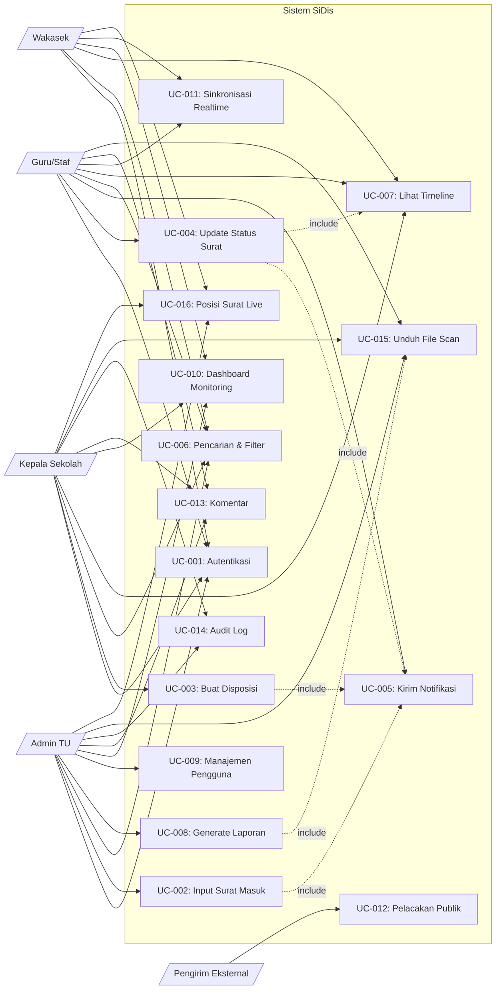
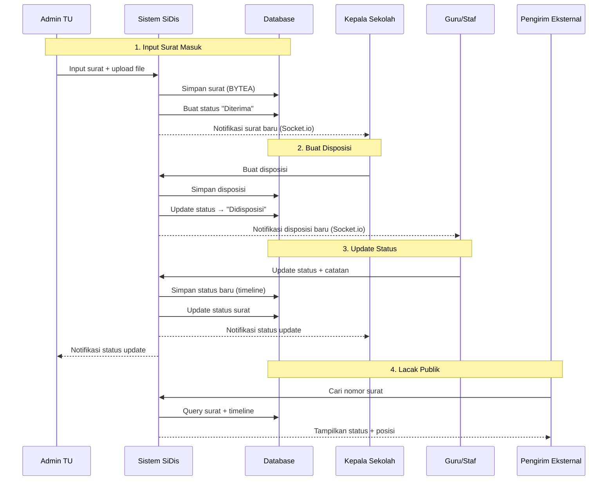

# Use Case Diagram — SiDis

**Proyek:** SiDis — Sistem Informasi Disposisi dan Pelacakan Surat Digital

**Tim:** Nexus — Kelompok 8

---

## Diagram Use Case

---

## Daftar Actor

| No | Actor | Jumlah | Deskripsi |
|----|-------|--------|-----------|
| 1 | Admin TU | 1 orang | Menginput surat masuk, mengelola pengguna, mencetak laporan |
| 2 | Kepala Sekolah | 1 orang | Membuat disposisi digital kepada Guru/Staf |
| 3 | Guru/Staf | 5 orang (5 bidang) | Menerima disposisi, memperbarui status penyelesaian |
| 4 | Wakasek | 4 orang (4 bidang) | Memantau surat sesuai bidang |
| 5 | Pengirim Eksternal | Tidak terbatas | Melacak posisi surat via nomor surat (tanpa login) |

---

## Daftar Use Case

| No | Use Case | Actor Utama | Deskripsi |
|----|----------|-------------|-----------|
| UC-001 | Autentikasi | Semua | Login dengan JWT, 4 role dengan hak akses berbeda |
| UC-002 | Input Surat Masuk | Admin TU | Form input + upload file scan (BYTEA di database) |
| UC-003 | Buat Disposisi | Kepala Sekolah | Pilih penerima, tulis instruksi, set deadline |
| UC-004 | Update Status Surat | Guru/Staf | Update status: Diproses → Selesai + catatan |
| UC-005 | Kirim Notifikasi | Sistem | Notifikasi otomatis via Socket.io ≤2 detik |
| UC-006 | Pencarian & Filter | Semua Internal | Search by nomor, pengirim, perihal, tanggal |
| UC-007 | Lihat Timeline | Semua Internal | Riwayat perubahan status (event sourcing) |
| UC-008 | Generate Laporan | Admin TU | Generate + export laporan harian/mingguan/bulanan PDF |
| UC-009 | Manajemen Pengguna | Admin TU | CRUD pengguna, physical delete dengan ON DELETE SET NULL |
| UC-010 | Dashboard Monitoring | Admin, Kepala, Wakasek | Statistik surat, posisi surat, surat terbaru |
| UC-011 | Sinkronisasi Realtime | Guru, Wakasek | Multi-tab sync, auto-reconnect, resync |
| UC-012 | Pelacakan Publik | Pengirim Eksternal | `/lacak` tanpa login, rate limit 30/15menit |
| UC-013 | Komentar | Admin, Kepala, Guru | Catatan/komentar pada surat tertentu |
| UC-014 | Audit Log | Admin, Kepala | Jejak aktivitas (create, update, login) |
| UC-015 | Unduh File Scan | Admin, Kepala, Guru | Download file dari database (BYTEA → blob) |
| UC-016 | Posisi Surat Live | Admin, Kepala, Wakasek | Tabel posisi surat real-time |

---

## Relasi Use Case

| Relasi | Tipe | Penjelasan |
|--------|------|------------|
| UC-002 → UC-005 | include | Input surat selalu diikuti notifikasi ke Kepala Sekolah |
| UC-003 → UC-005 | include | Buat disposisi selalu diikuti notifikasi ke penerima |
| UC-004 → UC-005 | include | Update status selalu diikuti notifikasi ke Kepala + Admin |
| UC-004 → UC-007 | include | Update status selalu mencatat timeline |
| UC-008 → UC-015 | include | Generate laporan bisa diikuti download PDF |

---

## Hak Akses per Use Case

| Use Case | Admin TU | Kepala Sekolah | Guru/Staf | Wakasek | Publik |
|----------|----------|----------------|-----------|---------|--------|
| UC-001: Autentikasi | ✓ | ✓ | ✓ | ✓ | ✗ |
| UC-002: Input Surat | ✓ | ✗ | ✗ | ✗ | ✗ |
| UC-003: Buat Disposisi | ✗ | ✓ | ✗ | ✗ | ✗ |
| UC-004: Update Status | ✗ | ✗ | ✓ | ✗ | ✗ |
| UC-005: Notifikasi | ✓ | ✓ | ✓ | ✓ | ✗ |
| UC-006: Pencarian | ✓ | ✓ | ✓ | ✓ | ✗ |
| UC-007: Timeline | ✓ | ✓ | ✓ | ✓ | ✗ |
| UC-008: Laporan | ✓ | ✗ | ✗ | ✗ | ✗ |
| UC-009: Manajemen User | ✓ | ✗ | ✗ | ✗ | ✗ |
| UC-010: Dashboard | ✓ | ✓ | ✗ | ✓ | ✗ |
| UC-011: Sinkronisasi | ✗ | ✗ | ✓ | ✓ | ✗ |
| UC-012: Pelacakan Publik | ✗ | ✗ | ✗ | ✗ | ✓ |
| UC-013: Komentar | ✓ | ✓ | ✓ | ✗ | ✗ |
| UC-014: Audit Log | ✓ | ✓ | ✗ | ✗ | ✗ |
| UC-015: Unduh File | ✓ | ✓ | ✓ | ✗ | ✗ |
| UC-016: Posisi Surat | ✓ | ✓ | ✗ | ✓ | ✗ |

---

## Sequence Diagram (Alur Utama)

