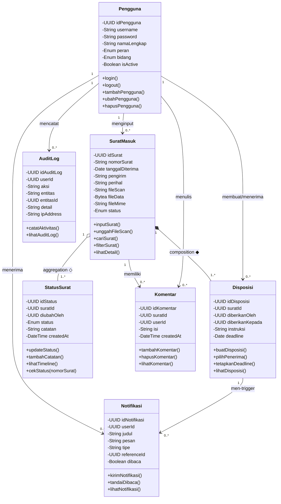

# Class Diagram — SiDis

**Proyek:** SiDis — Sistem Informasi Disposisi dan Pelacakan Surat Digital

**Institusi:** SMP Muhammadiyah 9 Yogyakarta

**Mata Kuliah:** Desain dan Pengembangan Sistem Informasi

---

## B. Studi Kasus

### Judul Studi Kasus

SiDis — Sistem Informasi Disposisi dan Pelacakan Surat Digital SMP Muhammadiyah 9 Yogyakarta

### Deskripsi Singkat Sistem

SiDis adalah aplikasi web yang berfungsi sebagai platform terpusat untuk mengelola seluruh alur persuratan di SMP Muhammadiyah 9 Yogyakarta secara digital. Sistem menggantikan proses manual berbasis buku agenda fisik dan WhatsApp dengan alur yang terstruktur, terlacak, dan transparan — mirip konsep pelacakan paket pengiriman, namun diterapkan pada konteks administrasi surat sekolah.

Aktor yang terlibat: Admin TU (menginput surat), Kepala Sekolah (membuat disposisi digital), Guru/Staf (menerima disposisi dan memperbarui status), serta Wakil Kepala Sekolah (memantau surat sesuai bidang). Proses utama: input surat masuk → notifikasi otomatis → disposisi digital → update status → monitoring & laporan rekapitulasi.

---

## C. Identifikasi Class

Berdasarkan analisis use case dan kebutuhan fungsional sistem SiDis, diidentifikasi 7 class utama berikut:

| No | Nama Class | Deskripsi |
|----|-----------|-----------|
| 1 | Pengguna | Menyimpan data seluruh pengguna internal sistem (Admin TU, Kepala Sekolah, Guru/Staf, Wakasek) beserta peran akses masing-masing. Pengirim surat eksternal tidak memiliki akun. |
| 2 | SuratMasuk | Menyimpan data surat masuk dari pihak eksternal beserta file scan digital (BYTEA di database). |
| 3 | Disposisi | Menyimpan data disposisi digital yang dibuat Kepala Sekolah kepada Guru/Staf. |
| 4 | StatusSurat | Menyimpan riwayat perubahan status surat membentuk timeline alur dari awal hingga selesai (event sourcing). |
| 5 | Notifikasi | Menyimpan dan mengirimkan notifikasi otomatis kepada pengguna internal terkait. |
| 6 | Komentar | Menyimpan komentar atau catatan tambahan pada surat dari pengguna internal. |
| 7 | AuditLog | Mencatat seluruh aktivitas penting sistem untuk keperluan audit trail dan pelacakan. |

---

## D. Detail Class

Notasi penulisan mengikuti standar UML berdasarkan materi perkuliahan:
- Visibilitas: `+` (public), `-` (private)
- Format atribut: `[visibilitas] [namaAtribut] : [TipeData]`
- Format method: `[visibilitas] [namaMethod](parameter)`

### Class: Pengguna

**Atribut:**

| No | Nama Atribut | Tipe Data | Keterangan |
|----|-------------|-----------|------------|
| 1 | - idPengguna : UUID | UUID | Primary key, kode unik pengguna (auto-generate) |
| 2 | - username : String | String(50) | Nama login pengguna (unique) |
| 3 | - password : String | String(255) | Kata sandi (terenkripsi bcrypt) |
| 4 | - namaLengkap : String | String(100) | Nama lengkap pengguna |
| 5 | - peran : Enum | Enum | Peran: ADMIN_TU, KEPALA_SEKOLAH, GURU_STAF, WAKASEK |
| 6 | - bidang : Enum | Enum | Bidang: Kurikulum, Kesiswaan, SaranaPrasarana, Humas, Keuangan |
| 7 | - isActive : Boolean | Boolean | Status aktif/nonaktif akun (default: true) |

**Method:**

| No | Nama Method | Keterangan |
|----|------------|------------|
| 1 | + login() | Autentikasi pengguna dengan username dan password |
| 2 | + logout() | Mengakhiri sesi pengguna yang sedang aktif |
| 3 | + tambahPengguna() | Admin TU menambahkan akun pengguna internal baru ke sistem |
| 4 | + ubahPengguna() | Mengubah data akun pengguna yang sudah ada |
| 5 | + hapusPengguna() | Menghapus akun pengguna dari sistem |

---

### Class: SuratMasuk

**Atribut:**

| No | Nama Atribut | Tipe Data | Keterangan |
|----|-------------|-----------|------------|
| 1 | - idSurat : UUID | UUID | Primary key, kode unik surat (auto-generate) |
| 2 | - nomorSurat : String | String(50) | Nomor surat dari pengirim — digunakan untuk pelacakan eksternal |
| 3 | - tanggalDiterima : Date | Date | Tanggal surat diterima Admin TU |
| 4 | - pengirim : String | String(200) | Nama instansi atau individu pengirim |
| 5 | - perihal : String | String(300) | Pokok isi surat secara ringkas |
| 6 | - fileScan : String | String(500) | URL/path lokasi file scan surat |
| 7 | - fileData : Bytea | BYTEA | Data file scan surat tersimpan langsung di database |
| 8 | - fileMime : String | String(50) | Tipe MIME file (application/pdf, image/jpeg, dst.) |
| 9 | - status : Enum | Enum | Diterima / Didisposisi / Diproses / Selesai |

**Method:**

| No | Nama Method | Keterangan |
|----|------------|------------|
| 1 | + inputSurat() | Menambahkan data surat masuk baru ke sistem |
| 2 | + unggahFileScan() | Mengunggah file scan surat format PDF atau gambar (disimpan sebagai BYTEA) |
| 3 | + cariSurat() | Mencari surat berdasarkan nomor, tanggal, pengirim, atau perihal |
| 4 | + filterSurat() | Memfilter daftar surat berdasarkan kriteria tertentu |
| 5 | + lihatDetail() | Menampilkan detail lengkap surat beserta riwayat alurnya |

---

### Class: Disposisi

**Atribut:**

| No | Nama Atribut | Tipe Data | Keterangan |
|----|-------------|-----------|------------|
| 1 | - idDisposisi : UUID | UUID | Primary key, kode unik disposisi (auto-generate) |
| 2 | - suratId : UUID | UUID | Foreign key ke SuratMasuk |
| 3 | - diberikanOleh : UUID | UUID | Foreign key Kepala Sekolah (pembuat disposisi) |
| 4 | - diberikanKepada : UUID | UUID | Foreign key Guru/Staf penerima disposisi |
| 5 | - instruksi : String | Text | Instruksi tugas dari Kepala Sekolah |
| 6 | - deadline : Date | Date | Batas waktu penyelesaian tugas |

**Method:**

| No | Nama Method | Keterangan |
|----|------------|------------|
| 1 | + buatDisposisi() | Membuat disposisi digital baru untuk surat masuk |
| 2 | + pilihPenerima() | Memilih Guru/Staf sebagai penerima disposisi |
| 3 | + tetapkanDeadline() | Menetapkan batas waktu penyelesaian disposisi |
| 4 | + lihatDisposisi() | Menampilkan detail disposisi beserta instruksi tugas |

---

### Class: StatusSurat

**Atribut:**

| No | Nama Atribut | Tipe Data | Keterangan |
|----|-------------|-----------|------------|
| 1 | - idStatus : UUID | UUID | Primary key, kode unik entri status (auto-generate) |
| 2 | - suratId : UUID | UUID | Foreign key ke SuratMasuk |
| 3 | - diubahOleh : UUID | UUID | Foreign key pengguna yang mengubah status |
| 4 | - status : Enum | Enum | Diterima / Didisposisi / Diproses / Selesai |
| 5 | - catatan : String | Text | Catatan tindak lanjut dari Guru/Staf |
| 6 | - createdAt : DateTime | DateTime | Timestamp perubahan status dicatat sistem |

**Method:**

| No | Nama Method | Keterangan |
|----|------------|------------|
| 1 | + updateStatus() | Memperbarui status surat menjadi Diproses atau Selesai |
| 2 | + tambahCatatan() | Menambahkan catatan tindak lanjut pada pembaruan status |
| 3 | + lihatTimeline() | Menampilkan riwayat lengkap alur surat dari awal hingga selesai |
| 4 | + cekStatus(nomorSurat) | Menampilkan status terkini surat. Dapat diakses pengirim eksternal tanpa login. |

---

### Class: Notifikasi

**Atribut:**

| No | Nama Atribut | Tipe Data | Keterangan |
|----|-------------|-----------|------------|
| 1 | - idNotifikasi : UUID | UUID | Primary key, kode unik notifikasi |
| 2 | - userId : UUID | UUID | Foreign key pengguna penerima notifikasi |
| 3 | - judul : String | String(200) | Judul singkat notifikasi |
| 4 | - pesan : String | Text | Isi pesan notifikasi yang dikirim |
| 5 | - tipe : String | String(50) | surat_baru / disposisi_baru / status_update |
| 6 | - referenceId : UUID | UUID | ID entitas terkait (surat, disposisi, dll.) |
| 7 | - dibaca : Boolean | Boolean | Menandai apakah notifikasi sudah dibaca (default: false) |

**Method:**

| No | Nama Method | Keterangan |
|----|------------|------------|
| 1 | + kirimNotifikasi() | Mengirimkan notifikasi otomatis ke pengguna yang relevan |
| 2 | + tandaiDibaca() | Menandai notifikasi sebagai sudah dibaca oleh pengguna |
| 3 | + lihatNotifikasi() | Menampilkan daftar seluruh notifikasi milik pengguna |

---

### Class: Komentar

**Atribut:**

| No | Nama Atribut | Tipe Data | Keterangan |
|----|-------------|-----------|------------|
| 1 | - idKomentar : UUID | UUID | Primary key, kode unik komentar (auto-generate) |
| 2 | - suratId : UUID | UUID | Foreign key ke SuratMasuk |
| 3 | - userId : UUID | UUID | Foreign key pengguna yang menulis komentar |
| 4 | - isi : String | Text | Isi komentar atau catatan |
| 5 | - createdAt : DateTime | DateTime | Waktu komentar ditulis |

**Method:**

| No | Nama Method | Keterangan |
|----|------------|------------|
| 1 | + tambahKomentar() | Menambahkan komentar atau catatan pada surat |
| 2 | + hapusKomentar() | Menghapus komentar milik sendiri |
| 3 | + lihatKomentar() | Menampilkan seluruh komentar pada surat tertentu |

---

### Class: AuditLog

**Atribut:**

| No | Nama Atribut | Tipe Data | Keterangan |
|----|-------------|-----------|------------|
| 1 | - idAuditLog : UUID | UUID | Primary key, kode unik log (auto-generate) |
| 2 | - userId : UUID | UUID | Foreign key pengguna yang melakukan aksi |
| 3 | - aksi : String | String(100) | Jenis aksi (create, update, delete, login, dll.) |
| 4 | - entitas : String | String(50) | Entitas yang terpengaruh (surat, disposisi, pengguna, dll.) |
| 5 | - entitasId : UUID | UUID | ID entitas yang terpengaruh |
| 6 | - detail : String | Text | Deskripsi detail aksi |
| 7 | - ipAddress : String | String(50) | Alamat IP pengguna saat melakukan aksi |

**Method:**

| No | Nama Method | Keterangan |
|----|------------|------------|
| 1 | + catatAktivitas() | Mencatat aktivitas penting ke dalam log audit |
| 2 | + lihatAuditLog() | Menampilkan riwayat aktivitas sistem (hanya Admin TU & Kepala) |

---

## E. Relasi Antar Class

### Dasar Teori Relasi

- **Association:** Hubungan umum antar dua class di mana satu class menggunakan atau berinteraksi dengan class lain.
- **Aggregation (◇ belah ketupat kosong):** Hubungan Whole-Part yang longgar (independent). Bagian tetap bisa eksis meskipun dipisah dari keseluruhan.
- **Composition (◆ belah ketupat penuh):** Hubungan Whole-Part yang ketat (dependent). Bagian tidak bermakna jika kelas keseluruhan dihancurkan.

### Tabel Relasi

| No | Class 1 | Jenis Relasi | Class 2 | Multiplisitas | Keterangan |
|----|---------|-------------|---------|---------------|------------|
| 1 | Pengguna | Association | SuratMasuk | 1 — 0..* | Admin TU (Pengguna) menginput dan mengelola data SuratMasuk |
| 2 | SuratMasuk | Composition ◆ | Disposisi | 1 — 1..* | Disposisi tidak dapat berdiri sendiri tanpa SuratMasuk. Jika SuratMasuk dihapus, Disposisi ikut terhapus (ON DELETE CASCADE). |
| 3 | Pengguna | Association | Disposisi | 1 — 0..* | Kepala Sekolah membuat Disposisi; Guru/Staf menerima Disposisi |
| 4 | SuratMasuk | Aggregation ◇ | StatusSurat | 1 — 1..* | Satu SuratMasuk memiliki banyak entri StatusSurat membentuk timeline. StatusSurat bersifat independen sebagai audit trail. |
| 5 | Pengguna | Association | Notifikasi | 1 — 0..* | Sistem mengirim Notifikasi ke Pengguna yang berwenang |
| 6 | SuratMasuk | Association | Komentar | 1 — 0..* | Pengguna dapat menulis komentar pada SuratMasuk |
| 7 | Pengguna | Association | Komentar | 1 — 0..* | Pengguna menulis Komentar |
| 8 | Pengguna | Association | AuditLog | 1 — 0..* | Setiap aktivitas pengguna tercatat di AuditLog |
| 9 | Disposisi | Association | Notifikasi | 1 — 0..* | Pembuatan Disposisi baru men-trigger Notifikasi ke penerima |

### Justifikasi Pemilihan Relasi Composition dan Aggregation

**SuratMasuk ◆ Disposisi (Composition):** Disposisi tidak memiliki makna tanpa SuratMasuk yang mendahuluinya. Jika sebuah SuratMasuk dihapus, seluruh Disposisi yang terkait akan ikut terhapus karena keberadaannya bergantung penuh pada SuratMasuk. Implementasi di database menggunakan `ON DELETE CASCADE` pada foreign key `surat_id`. Analogi: Relasi Rumah — Kamar tidak bisa berdiri sendiri tanpa Rumah.

**SuratMasuk ◇ StatusSurat (Aggregation):** StatusSurat menyimpan riwayat perubahan status yang membentuk timeline audit trail. Data riwayat ini bersifat independen dan tetap bermakna sebagai catatan historis meskipun surat diarsipkan atau statusnya berubah. Implementasi di database menggunakan `ON DELETE CASCADE` pada foreign key `surat_id`, namun secara konseptual riwayat status merupakan data historis yang seharusnya dipertahankan. Analogi: Relasi Fakultas — Dosen tetap eksis sebagai entitas meskipun dipisahkan dari fakultas tertentu.

---

## F. Class Diagram

---

## G. Penjelasan Diagram

**Class Pengguna** adalah kelas sentral yang merepresentasikan seluruh pengguna internal sistem yang memiliki akun, yaitu Admin TU, Kepala Sekolah, Guru/Staf, dan Wakil Kepala Sekolah (Wakasek). Pengirim surat dari pihak eksternal tidak dimodelkan sebagai pengguna sistem — mereka hanya menggunakan `nomorSurat` untuk melacak posisi surat tanpa perlu login, konsisten dengan konsep pelacakan paket. Atribut `isActive` mendukung mekanisme soft delete di mana pengguna yang dihapus tidak benar-benar hilang dari database. Bidang yang tersedia adalah Kurikulum, Kesiswaan, SaranaPrasarana, Humas, dan Keuangan (Keuangan diisi oleh Bendahara, tidak memiliki Wakasek).

**Class SuratMasuk** adalah kelas inti yang menjadi titik awal seluruh alur kerja sistem. Atribut `status` menggunakan tipe Enum dengan nilai yang telah didefinisikan: Diterima, Didisposisi, Diproses, atau Selesai — sehingga mencegah input tidak valid. Tipe data ID menggunakan UUID untuk keunikan global. Atribut `fileData` (BYTEA) dan `fileMime` menyimpan file scan surat langsung di Neon PostgreSQL, sehingga tidak bergantung pada filesystem lokal yang dapat hilang saat server restart. SuratMasuk berelasi Composition (◆) dengan Disposisi karena Disposisi tidak dapat eksis tanpa SuratMasuk yang mendahuluinya, dan berelasi Aggregation (◇) dengan StatusSurat karena riwayat status bersifat independen sebagai audit trail.

**Class Disposisi** memodelkan proses disposisi digital dari Kepala Sekolah kepada Guru/Staf. Seluruh atribut ID menggunakan tipe UUID. Atribut `diberikanOleh` dan `diberikanKepada` merupakan foreign key yang merujuk ke class Pengguna, sedangkan atribut `deadline` bertipe Date untuk mendukung fitur pemantauan surat overdue.

**Class StatusSurat** menyimpan setiap perubahan status sebagai entri baru dengan pola event sourcing — satu baris merepresentasikan satu perubahan status. Timeline alur surat terbentuk dari kumpulan baris yang diurutkan berdasarkan `createdAt`. Method `cekStatus(nomorSurat)` berfungsi menampilkan posisi surat dalam alur proses — bukan lokasi fisik — seperti: Masih di Admin TU, Sudah di Kepala Sekolah, Sudah didisposisi ke Guru/Staf, atau Sudah Selesai. Method ini dapat diakses pengirim eksternal menggunakan `nomorSurat` tanpa login.

**Class Notifikasi** dikirim secara otomatis ke pengguna internal setiap ada SuratMasuk baru atau perubahan status Disposisi, menggantikan mekanisme notifikasi manual via WhatsApp yang diidentifikasi sebagai masalah utama dalam observasi lapangan. Atribut `judul` memberikan ringkasan singkat isi notifikasi, dan `referenceId` memungkinkan navigasi langsung ke entitas terkait.

**Class Komentar** memungkinkan pengguna internal menulis komentar atau catatan tambahan pada surat, mendukung kolaborasi dan komunikasi antar bagian terkait proses disposisi.

**Class AuditLog** mencatat seluruh aktivitas penting sistem (create, update, delete, login) beserta IP address untuk keperluan audit trail, keamanan, dan pelacakan aktivitas pengguna.

---

## H. Mapping ke Database

| Class | Tabel di Neon PostgreSQL | Keterangan |
|-------|------------------------|------------|
| Pengguna | `pengguna` | Tabel utama user dengan role, bidang, is_active |
| SuratMasuk | `surat_masuk` | File scan disimpan sebagai BYTEA |
| Disposisi | `disposisi` | ON DELETE CASCADE ke surat_masuk |
| StatusSurat | `status_surat` | Event sourcing timeline |
| Notifikasi | `notifikasi` | Auto-generated oleh sistem |
| Komentar | `komentar` | ON DELETE CASCADE ke surat_masuk |
| AuditLog | `audit_log` | Catatan aktivitas sistem |
| *(Laporan)* | *Query agregat* | *Bukan tabel — di-generate dari surat_masuk* |
