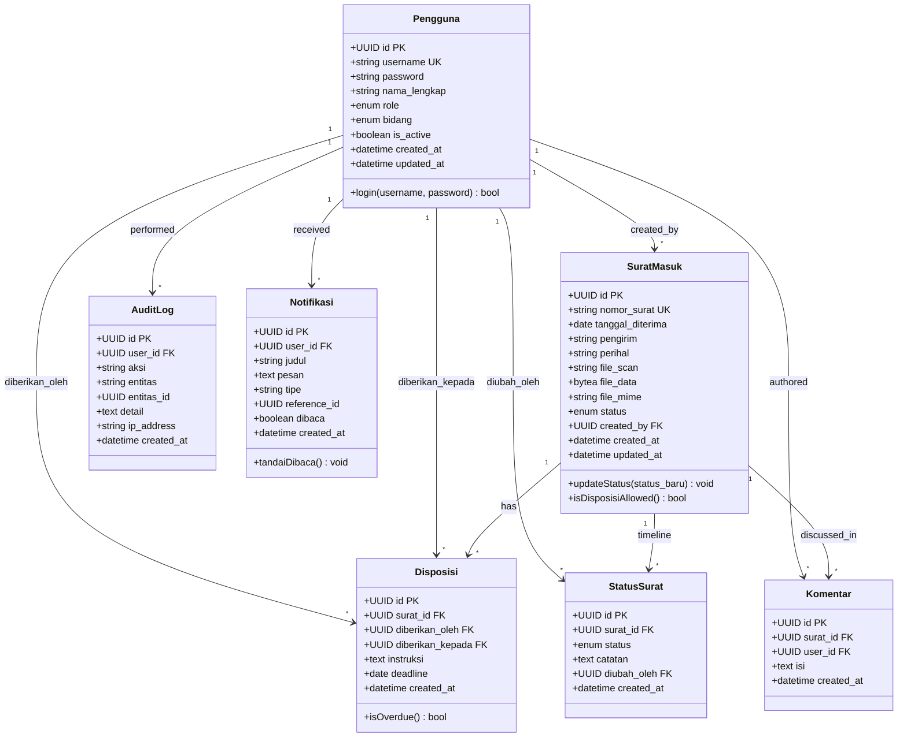

# Data Model

Document Version: v1.0

Project: SiDis — Sistem Informasi Disposisi dan Pelacakan Surat Digital

Product: Web-Based Letter Disposition & Tracking System

Status: Validated / Active

Last Updated: 2026-07-16

Author: System Analyst AI

Source: Derived from SRS v1.0 (SoT-1) & `server/config/db-init.js`

---

## 1. Overview

Dokumen ini mendefinisikan model data untuk sistem SiDis (Sistem Informasi Disposisi dan Pelacakan Surat Digital) di SMP Muhammadiyah 9 Yogyakarta. Model diturunkan dari Objek Bisnis Inti yang didefinisikan dalam SRS v1.0 dan skrip inisialisasi database yang sebenarnya (`db-init.js`).

Sistem mengelola 7 entitas yang mencakup manajemen pengguna, registrasi surat masuk, disposisi digital, pelacakan status, diskusi tim, pencatatan audit, dan notifikasi real-time.

---

## 2. Class Diagram



---

## 3. Entity Descriptions

### 3.1 Pengguna

Mewakili semua pengguna sistem (Admin TU, Kepala Sekolah, Guru/Staf, Kepala Bidang) yang mengautentikasi melalui JWT dan memiliki akses berdasarkan peran.

| Attribute | Tipe | Constraint | Deskripsi |
|---|---|---|---|
| id | UUID | PRIMARY KEY, DEFAULT gen_random_uuid() | Pengenal unik |
| username | VARCHAR(50) | UNIQUE, NOT NULL | Username login |
| password | VARCHAR(255) | NOT NULL | Password ter-hash (bcrypt, 10 rounds) |
| nama_lengkap | VARCHAR(100) | NOT NULL | Nama tampilan lengkap |
| role | ENUM(role_pengguna) | NOT NULL | `ADMIN_TU`, `KEPALA_SEKOLAH`, `GURU_STAF`, `KEPALA_BIDANG` |
| bidang | ENUM(bidang_enum) | NULLABLE | `Kurikulum`, `Kesiswaan`, `SaranaPrasarana`, `Humas`, `Keuangan` (null untuk Admin & Kepsek) |
| is_active | BOOLEAN | DEFAULT true | Status akun aktif |
| created_at | TIMESTAMP | DEFAULT NOW() | Waktu pembuatan akun |
| updated_at | TIMESTAMP | DEFAULT NOW() | Waktu pembaruan terakhir |

### 3.2 SuratMasuk

Entitas bisnis inti yang mewakili surat masuk yang didaftarkan oleh Admin TU. Berisi metadata, file scan (disimpan sebagai BYTEA di Neon), dan status alur kerja saat ini.

| Attribute | Tipe | Constraint | Deskripsi |
|---|---|---|---|
| id | UUID | PRIMARY KEY, DEFAULT gen_random_uuid() | Pengenal unik |
| nomor_surat | VARCHAR(50) | UNIQUE, NOT NULL | Nomor surat dari pengirim |
| tanggal_diterima | DATE | NOT NULL | Tanggal surat diterima secara fisik |
| pengirim | VARCHAR(200) | NOT NULL | Nama pengirim (lembaga atau individu) |
| perihal | VARCHAR(300) | NOT NULL | Perihal surat |
| file_scan | VARCHAR(500) | NULLABLE | Nama file asli untuk referensi |
| file_data | BYTEA | NULLABLE | Data biner file scan (PDF/JPG/PNG) |
| file_mime | VARCHAR(50) | NULLABLE | Tipe MIME (application/pdf, image/jpeg, image/png) |
| status | ENUM(status_surat_enum) | DEFAULT 'Diterima' | Status alur kerja saat ini |
| created_by | UUID | FK → Pengguna.id | Admin TU yang membuat catatan |
| created_at | TIMESTAMP | DEFAULT NOW() | Waktu pembuatan catatan |
| updated_at | TIMESTAMP | DEFAULT NOW() | Waktu pembaruan terakhir |

### 3.3 Disposisi

Catatan disposisi digital yang dibuat oleh Kepala Sekolah, menugaskan surat ke Guru/Staf tertentu dengan instruksi dan tenggat waktu.

| Attribute | Tipe | Constraint | Deskripsi |
|---|---|---|---|
| id | UUID | PRIMARY KEY, DEFAULT gen_random_uuid() | Pengenal unik |
| surat_id | UUID | FK → SuratMasuk.id, ON DELETE CASCADE | Surat masuk yang dirujuk |
| diberikan_oleh | UUID | FK → Pengguna.id | Kepala Sekolah yang membuat disposisi |
| diberikan_kepada | UUID | FK → Pengguna.id | Penerima disposisi (Guru/Staf) |
| instruksi | TEXT | NOT NULL | Instruksi tugas |
| deadline | DATE | NOT NULL | Batas waktu penyelesaian tugas |
| created_at | TIMESTAMP | DEFAULT NOW() | Waktu pembuatan catatan |

### 3.4 StatusSurat

Pelacakan timeline status berbasis event-sourced yang mencatat setiap perubahan status surat sepanjang siklus hidupnya (Diterima → Didisposisi → Diproses → Selesai).

| Attribute | Tipe | Constraint | Deskripsi |
|---|---|---|---|
| id | UUID | PRIMARY KEY, DEFAULT gen_random_uuid() | Pengenal unik |
| surat_id | UUID | FK → SuratMasuk.id, ON DELETE CASCADE | Surat masuk yang dirujuk |
| status | ENUM(status_surat_enum) | NOT NULL | Nilai status baru |
| catatan | TEXT | NULLABLE | Catatan perubahan opsional |
| diubah_oleh | UUID | FK → Pengguna.id | Pengguna yang mengubah status |
| created_at | TIMESTAMP | DEFAULT NOW() | Waktu perubahan status |

### 3.5 Komentar

Komentar diskusi tim pada surat, memungkinkan kolaborasi internal antar aktor yang berwenang.

| Attribute | Tipe | Constraint | Deskripsi |
|---|---|---|---|
| id | UUID | PRIMARY KEY, DEFAULT gen_random_uuid() | Pengenal unik |
| surat_id | UUID | FK → SuratMasuk.id, ON DELETE CASCADE | Surat masuk yang dirujuk |
| user_id | UUID | FK → Pengguna.id | Penulis komentar |
| isi | TEXT | NOT NULL | Isi komentar |
| created_at | TIMESTAMP | DEFAULT NOW() | Waktu pembuatan komentar |

### 3.6 AuditLog

Jejak audit yang tidak dapat diubah yang mencatat semua perubahan sistem (CREATE, UPDATE_STATUS, DELETE) untuk kepatuhan dan pelacakan.

| Attribute | Tipe | Constraint | Deskripsi |
|---|---|---|---|
| id | UUID | PRIMARY KEY, DEFAULT gen_random_uuid() | Pengenal unik |
| user_id | UUID | FK → Pengguna.id | Pengguna yang melakukan aksi |
| aksi | VARCHAR(100) | NOT NULL | Tipe aksi (CREATE, UPDATE_STATUS, DELETE) |
| entitas | VARCHAR(50) | NOT NULL | Entitas yang terpengaruh (surat_masuk, disposisi, pengguna) |
| entitas_id | UUID | NULLABLE | ID catatan yang terpengaruh |
| detail | TEXT | NULLABLE | Deskripsi perubahan yang dapat dibaca manusia |
| ip_address | VARCHAR(50) | NULLABLE | Alamat IP pengguna |
| created_at | TIMESTAMP | DEFAULT NOW() | Waktu aksi |

### 3.7 Notifikasi

Notifikasi push internal yang dikirim melalui WebSocket, memberi tahu pengguna tentang peristiwa yang relevan (surat baru, disposisi baru, pembaruan status).

| Attribute | Tipe | Constraint | Deskripsi |
|---|---|---|---|
| id | UUID | PRIMARY KEY, DEFAULT gen_random_uuid() | Pengenal unik |
| user_id | UUID | FK → Pengguna.id, ON DELETE CASCADE | Penerima notifikasi |
| judul | VARCHAR(200) | NOT NULL | Judul notifikasi |
| pesan | TEXT | NOT NULL | Isi pesan notifikasi |
| tipe | VARCHAR(50) | NOT NULL | Tipe (surat_baru, disposisi_baru, status_update) |
| reference_id | UUID | NULLABLE | ID catatan terkait untuk deep linking |
| dibaca | BOOLEAN | DEFAULT false | Status sudah dibaca |
| created_at | TIMESTAMP | DEFAULT NOW() | Waktu pembuatan notifikasi |

---

## 4. Relationships

| Relasi | Tipe | Cardinality | Deskripsi |
|---|---|---|---|
| Pengguna → SuratMasuk | One-to-Many | 1:N | Satu Admin TU dapat membuat banyak catatan surat masuk |
| Pengguna → Disposisi (diberikan_oleh) | One-to-Many | 1:N | Satu Kepala Sekolah dapat membuat banyak disposisi |
| Pengguna → Disposisi (diberikan_kepada) | One-to-Many | 1:N | Satu Guru/Staf dapat menerima banyak disposisi |
| Pengguna → StatusSurat | One-to-Many | 1:N | Satu pengguna dapat mencatat banyak perubahan status |
| Pengguna → Komentar | One-to-Many | 1:N | Satu pengguna dapat menulis banyak komentar |
| Pengguna → AuditLog | One-to-Many | 1:N | Satu pengguna dapat menghasilkan banyak entri audit log |
| Pengguna → Notifikasi | One-to-Many | 1:N | Satu pengguna dapat menerima banyak notifikasi |
| SuratMasuk → Disposisi | One-to-Many | 1:N | Satu surat dapat memiliki banyak disposisi (BR-05) |
| SuratMasuk → StatusSurat | One-to-Many | 1:N | Satu surat memiliki banyak entri timeline status (BR-08) |
| SuratMasuk → Komentar | One-to-Many | 1:N | Satu surat dapat memiliki banyak komentar |

---

## 5. Business Rules

### 5.1 Aturan Pengguna

- Username harus unik di seluruh sistem (SRS Bagian 5).
- Password harus di-hash menggunakan bcrypt dengan 10 salt rounds (`db-init.js`).
- Hanya Admin TU yang dapat membuat akun pengguna — tidak ada pendaftaran publik (BR-02).
- Akun pengguna dapat dinonaktifkan (is_active = false) tetapi tidak dihapus secara fisik (SRS Bagian 5).
- Bidang wajib diisi untuk role GURU_STAF dan KEPALA_BIDANG; null untuk ADMIN_TU dan KEPALA_SEKOLAH.

### 5.2 Aturan Surat

- Nomor surat (nomor_surat) harus unik; dipotong spasi sebelum penyimpanan (BR-21).
- Alur status bersifat sekuensial: `Diterima` → `Didisposisi` → `Diproses` → `Selesai`. Tidak ada pelompatan atau pembalikan (BR-03).
- File scan harus berformat PDF, JPG, atau PNG, maksimal 10 MB (BR-12).
- Data file disimpan sebagai BYTEA di database Neon, bukan di file sistem (BR-20).
- Surat dengan status `Selesai` tidak dapat mengubah status lagi (BR-13).

### 5.3 Aturan Disposisi

- Hanya Kepala Sekolah yang dapat membuat disposisi (BR-04).
- Disposisi harus mencakup: penerima, instruksi, dan tenggat waktu (BR-04).
- Satu surat dapat memiliki banyak disposisi ke penerima yang berbeda (BR-05).
- Penerima disposisi harus berupa akun GURU_STAF yang aktif.

### 5.4 Aturan Pelacakan Status

- Setiap perubahan status harus dicatat sebagai entri baru di tabel status_surat (BR-08, event sourcing).
- Catatan status_surat bersifat tidak dapat diubah — begitu dibuat, tidak dapat dimodifikasi atau dihapus.

### 5.5 Aturan Notifikasi

- Kepala Sekolah menerima notifikasi untuk setiap surat masuk baru (BR-06).
- Guru/Staf menerima notifikasi untuk setiap disposisi baru yang ditugaskan kepada mereka (BR-07).
- Notifikasi dikirim melalui WebSocket secara real-time (BR-15).

### 5.6 Audit & Penyimpanan Data

- Semua aksi CREATE, UPDATE_STATUS, dan DELETE pada surat_masuk, disposisi, dan pengguna dicatat di audit_log (BR-19).
- Log audit hanya dapat dilihat oleh ADMIN_TU dan KEPALA_SEKOLAH (BR-19).
- Semua data transaksi disimpan secara permanen di Neon PostgreSQL (BR-14).

---

## 6. Indexes

| Tabel | Index | Kolom | Tujuan |
|---|---|---|---|
| pengguna | idx_pengguna_username | username | Pencarian login cepat berdasarkan username |
| pengguna | idx_pengguna_role | role | Query cepat berdasarkan peran |
| surat_masuk | idx_surat_nomor | nomor_surat | Pencarian cepat berdasarkan nomor surat |
| surat_masuk | idx_surat_tanggal | tanggal_diterima | Filtering rentang tanggal untuk laporan |
| surat_masuk | idx_surat_status | status | Filtering berdasarkan status |
| surat_masuk | idx_surat_pengirim | pengirim | Pencarian berdasarkan nama pengirim |
| surat_masuk | idx_surat_perihal | perihal | Pencarian berdasarkan perihal |
| disposisi | idx_disposisi_surat | surat_id | Pencarian cepat disposisi berdasarkan surat |
| disposisi | idx_disposisi_penerima | diberikan_kepada | Pencarian cepat disposisi berdasarkan penerima |
| status_surat | idx_status_surat | surat_id | Query timeline cepat berdasarkan surat |
| notifikasi | idx_notifikasi_user | user_id, dibaca | Query notifikasi belum dibaca |
| audit_log | idx_audit_entitas | entitas, entitas_id | Query jejak audit tingkat entitas |

---

## 7. SQL DDL (PostgreSQL / Neon)

```sql
-- Tipe ENUM kustom
CREATE TYPE role_pengguna AS ENUM ('ADMIN_TU', 'KEPALA_SEKOLAH', 'GURU_STAF', 'KEPALA_BIDANG');
CREATE TYPE status_surat_enum AS ENUM ('Diterima', 'Didisposisi', 'Diproses', 'Selesai');
CREATE TYPE bidang_enum AS ENUM ('Kurikulum', 'Kesiswaan', 'SaranaPrasarana', 'Humas', 'Keuangan');

-- Tabel: pengguna
CREATE TABLE pengguna (
  id UUID PRIMARY KEY DEFAULT gen_random_uuid(),
  username VARCHAR(50) UNIQUE NOT NULL,
  password VARCHAR(255) NOT NULL,
  nama_lengkap VARCHAR(100) NOT NULL,
  role role_pengguna NOT NULL,
  bidang bidang_enum,
  is_active BOOLEAN DEFAULT true,
  created_at TIMESTAMP DEFAULT NOW(),
  updated_at TIMESTAMP DEFAULT NOW()
);

-- Tabel: surat_masuk
CREATE TABLE surat_masuk (
  id UUID PRIMARY KEY DEFAULT gen_random_uuid(),
  nomor_surat VARCHAR(50) UNIQUE NOT NULL,
  tanggal_diterima DATE NOT NULL,
  pengirim VARCHAR(200) NOT NULL,
  perihal VARCHAR(300) NOT NULL,
  file_scan VARCHAR(500),
  file_data BYTEA,
  file_mime VARCHAR(50),
  status status_surat_enum DEFAULT 'Diterima',
  created_by UUID REFERENCES pengguna(id),
  created_at TIMESTAMP DEFAULT NOW(),
  updated_at TIMESTAMP DEFAULT NOW()
);

-- Tabel: disposisi
CREATE TABLE disposisi (
  id UUID PRIMARY KEY DEFAULT gen_random_uuid(),
  surat_id UUID REFERENCES surat_masuk(id) ON DELETE CASCADE,
  diberikan_oleh UUID REFERENCES pengguna(id),
  diberikan_kepada UUID REFERENCES pengguna(id),
  instruksi TEXT NOT NULL,
  deadline DATE NOT NULL,
  created_at TIMESTAMP DEFAULT NOW()
);

-- Tabel: status_surat
CREATE TABLE status_surat (
  id UUID PRIMARY KEY DEFAULT gen_random_uuid(),
  surat_id UUID REFERENCES surat_masuk(id) ON DELETE CASCADE,
  status status_surat_enum NOT NULL,
  catatan TEXT,
  diubah_oleh UUID REFERENCES pengguna(id),
  created_at TIMESTAMP DEFAULT NOW()
);

-- Tabel: komentar
CREATE TABLE komentar (
  id UUID PRIMARY KEY DEFAULT gen_random_uuid(),
  surat_id UUID REFERENCES surat_masuk(id) ON DELETE CASCADE,
  user_id UUID REFERENCES pengguna(id),
  isi TEXT NOT NULL,
  created_at TIMESTAMP DEFAULT NOW()
);

-- Tabel: audit_log
CREATE TABLE audit_log (
  id UUID PRIMARY KEY DEFAULT gen_random_uuid(),
  user_id UUID REFERENCES pengguna(id),
  aksi VARCHAR(100) NOT NULL,
  entitas VARCHAR(50) NOT NULL,
  entitas_id UUID,
  detail TEXT,
  ip_address VARCHAR(50),
  created_at TIMESTAMP DEFAULT NOW()
);

-- Tabel: notifikasi
CREATE TABLE notifikasi (
  id UUID PRIMARY KEY DEFAULT gen_random_uuid(),
  user_id UUID REFERENCES pengguna(id) ON DELETE CASCADE,
  judul VARCHAR(200) NOT NULL,
  pesan TEXT NOT NULL,
  tipe VARCHAR(50) NOT NULL,
  reference_id UUID,
  dibaca BOOLEAN DEFAULT false,
  created_at TIMESTAMP DEFAULT NOW()
);

-- Indexes
CREATE INDEX idx_pengguna_username ON pengguna(username);
CREATE INDEX idx_pengguna_role ON pengguna(role);
CREATE INDEX idx_surat_nomor ON surat_masuk(nomor_surat);
CREATE INDEX idx_surat_tanggal ON surat_masuk(tanggal_diterima);
CREATE INDEX idx_surat_status ON surat_masuk(status);
CREATE INDEX idx_surat_pengirim ON surat_masuk(pengirim);
CREATE INDEX idx_surat_perihal ON surat_masuk(perihal);
CREATE INDEX idx_disposisi_surat ON disposisi(surat_id);
CREATE INDEX idx_disposisi_penerima ON disposisi(diberikan_kepada);
CREATE INDEX idx_status_surat ON status_surat(surat_id);
CREATE INDEX idx_notifikasi_user ON notifikasi(user_id, dibaca);
CREATE INDEX idx_audit_entitas ON audit_log(entitas, entitas_id);
```

---

## 8. Traceability

| Entitas | Referensi SRS | Fitur |
|---|---|---|
| Pengguna | Bagian 5 (Skema), BR-01, BR-02 | F-01 (Login/Logout), F-02 (Manajemen Pengguna) |
| SuratMasuk | Bagian 5 (Skema), BR-03, BR-12, BR-20, BR-21 | F-03 (Input Surat Masuk) |
| Disposisi | Bagian 5 (Skema), BR-04, BR-05 | F-04 (Disposisi Digital) |
| StatusSurat | Bagian 5 (Skema), BR-08, BR-13 | F-05 (Update Status), F-08 (Timeline) |
| Komentar | Bagian 5 (Skema), BR-18 | F-13 (Komentar Diskusi) |
| AuditLog | Bagian 5 (Skema), BR-19 | F-15 (Audit Log) |
| Notifikasi | Bagian 5 (Skema), BR-06, BR-07 | F-06 (Notifikasi Otomatis) |
