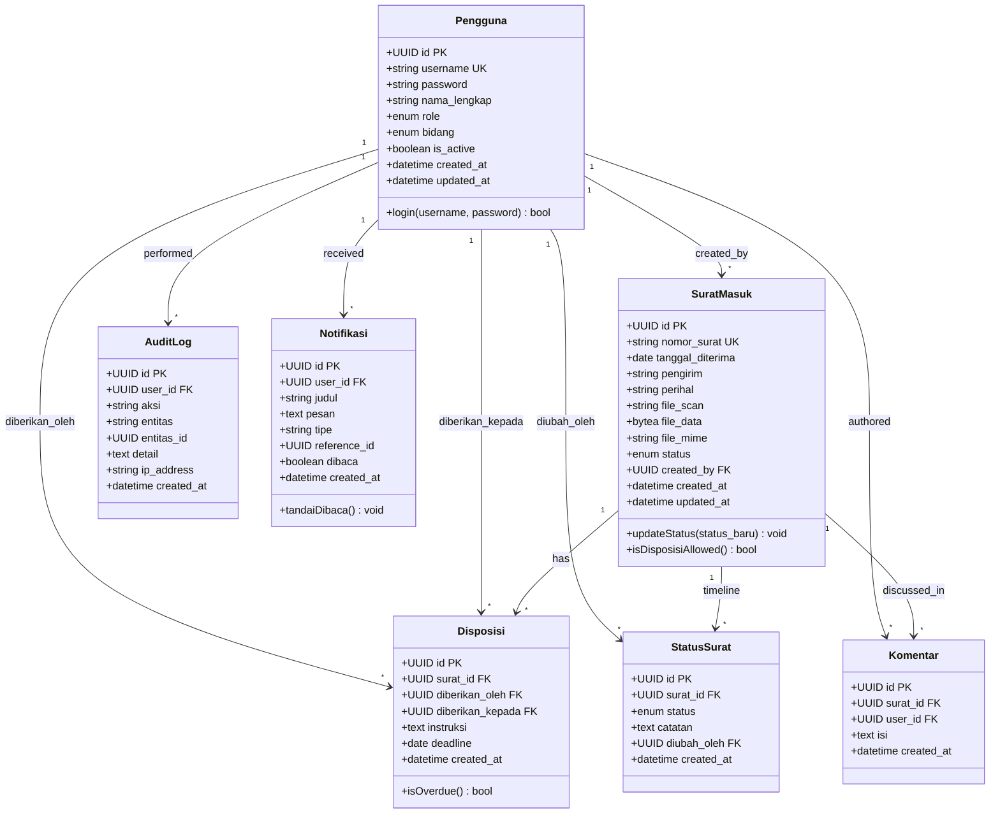

# Data Model

Document Version: v1.0

Project: SiDis — Sistem Informasi Disposisi dan Pelacakan Surat Digital

Product: Web-Based Letter Disposition & Tracking System

Status: Draft

Last Updated: 2026-07-10

Author: System Analyst AI

Source: Derived from SRS v1.0 (SoT-1) & `server/config/db-init.js`

---

## 1. Overview

This document defines the data model for the SiDis (Sistem Informasi Disposisi dan Pelacakan Surat Digital) system at SMP Muhammadiyah 9 Yogyakarta. The model is derived from the Core Business Objects defined in SRS v1.0 and the actual database initialization script (`db-init.js`).

The system manages 7 entities covering user management, incoming letter registration, digital disposition, status tracking, team discussion, audit logging, and real-time notifications.

---

## 2. Class Diagram



---

## 3. Entity Descriptions

### 3.1 Pengguna

Represents all system users (Admin TU, Kepala Sekolah, Guru/Staf, Wakasek) who authenticate via JWT and have role-based access.

| Attribute | Type | Constraint | Description |
|---|---|---|---|
| id | UUID | PRIMARY KEY, DEFAULT gen_random_uuid() | Unique identifier |
| username | VARCHAR(50) | UNIQUE, NOT NULL | Login username |
| password | VARCHAR(255) | NOT NULL | Hashed password (bcrypt, 10 rounds) |
| nama_lengkap | VARCHAR(100) | NOT NULL | Full display name |
| role | ENUM(role_pengguna) | NOT NULL | `ADMIN_TU`, `KEPALA_SEKOLAH`, `GURU_STAF`, `WAKASEK` |
| bidang | ENUM(bidang_enum) | NULLABLE | `Kurikulum`, `Kesiswaan`, `SaranaPrasarana`, `Humas`, `Keuangan` (null for Admin & Kepsek) |
| is_active | BOOLEAN | DEFAULT true | Account active status |
| created_at | TIMESTAMP | DEFAULT NOW() | Account creation timestamp |
| updated_at | TIMESTAMP | DEFAULT NOW() | Last update timestamp |

### 3.2 SuratMasuk

Core business entity representing an incoming letter registered by Admin TU. Contains metadata, scanned file (stored as BYTEA in Neon), and current workflow status.

| Attribute | Type | Constraint | Description |
|---|---|---|---|
| id | UUID | PRIMARY KEY, DEFAULT gen_random_uuid() | Unique identifier |
| nomor_surat | VARCHAR(50) | UNIQUE, NOT NULL | Letter number from sender |
| tanggal_diterima | DATE | NOT NULL | Date letter was physically received |
| pengirim | VARCHAR(200) | NOT NULL | Sender name (institution or individual) |
| perihal | VARCHAR(300) | NOT NULL | Letter subject |
| file_scan | VARCHAR(500) | NULLABLE | Original filename for reference |
| file_data | BYTEA | NULLABLE | Scanned file binary (PDF/JPG/PNG) |
| file_mime | VARCHAR(50) | NULLABLE | MIME type (application/pdf, image/jpeg, image/png) |
| status | ENUM(status_surat_enum) | DEFAULT 'Diterima' | Current workflow status |
| created_by | UUID | FK → Pengguna.id | Admin TU who created the record |
| created_at | TIMESTAMP | DEFAULT NOW() | Record creation timestamp |
| updated_at | TIMESTAMP | DEFAULT NOW() | Last update timestamp |

### 3.3 Disposisi

Digital disposition record created by Kepala Sekolah, assigning a letter to a specific Guru/Staf with instructions and deadline.

| Attribute | Type | Constraint | Description |
|---|---|---|---|
| id | UUID | PRIMARY KEY, DEFAULT gen_random_uuid() | Unique identifier |
| surat_id | UUID | FK → SuratMasuk.id, ON DELETE CASCADE | Referenced incoming letter |
| diberikan_oleh | UUID | FK → Pengguna.id | Kepala Sekolah who created the disposition |
| diberikan_kepada | UUID | FK → Pengguna.id | Guru/Staf recipient of the disposition |
| instruksi | TEXT | NOT NULL | Task instructions |
| deadline | DATE | NOT NULL | Due date for task completion |
| created_at | TIMESTAMP | DEFAULT NOW() | Record creation timestamp |

### 3.4 StatusSurat

Event-sourced status timeline tracking every status change of a letter throughout its lifecycle (Diterima → Didisposisi → Diproses → Selesai).

| Attribute | Type | Constraint | Description |
|---|---|---|---|
| id | UUID | PRIMARY KEY, DEFAULT gen_random_uuid() | Unique identifier |
| surat_id | UUID | FK → SuratMasuk.id, ON DELETE CASCADE | Referenced incoming letter |
| status | ENUM(status_surat_enum) | NOT NULL | New status value |
| catatan | TEXT | NULLABLE | Optional change note |
| diubah_oleh | UUID | FK → Pengguna.id | User who changed the status |
| created_at | TIMESTAMP | DEFAULT NOW() | Status change timestamp |

### 3.5 Komentar

Team discussion comments on letters, enabling internal collaboration among authorized actors.

| Attribute | Type | Constraint | Description |
|---|---|---|---|
| id | UUID | PRIMARY KEY, DEFAULT gen_random_uuid() | Unique identifier |
| surat_id | UUID | FK → SuratMasuk.id, ON DELETE CASCADE | Referenced incoming letter |
| user_id | UUID | FK → Pengguna.id | Author of the comment |
| isi | TEXT | NOT NULL | Comment content |
| created_at | TIMESTAMP | DEFAULT NOW() | Comment creation timestamp |

### 3.6 AuditLog

Immutable audit trail recording all system changes (CREATE, UPDATE_STATUS, DELETE) for compliance and traceability.

| Attribute | Type | Constraint | Description |
|---|---|---|---|
| id | UUID | PRIMARY KEY, DEFAULT gen_random_uuid() | Unique identifier |
| user_id | UUID | FK → Pengguna.id | User who performed the action |
| aksi | VARCHAR(100) | NOT NULL | Action type (CREATE, UPDATE_STATUS, DELETE) |
| entitas | VARCHAR(50) | NOT NULL | Affected entity (surat_masuk, disposisi, pengguna) |
| entitas_id | UUID | NULLABLE | ID of affected record |
| detail | TEXT | NULLABLE | Human-readable change description |
| ip_address | VARCHAR(50) | NULLABLE | User IP address |
| created_at | TIMESTAMP | DEFAULT NOW() | Action timestamp |

### 3.7 Notifikasi

Internal push notifications delivered via WebSocket, informing users of relevant events (new letter, new disposition, status update).

| Attribute | Type | Constraint | Description |
|---|---|---|---|
| id | UUID | PRIMARY KEY, DEFAULT gen_random_uuid() | Unique identifier |
| user_id | UUID | FK → Pengguna.id, ON DELETE CASCADE | Notification recipient |
| judul | VARCHAR(200) | NOT NULL | Notification title |
| pesan | TEXT | NOT NULL | Notification message body |
| tipe | VARCHAR(50) | NOT NULL | Type (surat_baru, disposisi_baru, status_update) |
| reference_id | UUID | NULLABLE | Related record ID for deep linking |
| dibaca | BOOLEAN | DEFAULT false | Read status |
| created_at | TIMESTAMP | DEFAULT NOW() | Notification creation timestamp |

---

## 4. Relationships

| Relationship | Type | Cardinality | Description |
|---|---|---|---|
| Pengguna → SuratMasuk | One-to-Many | 1:N | One Admin TU can create many incoming letter records |
| Pengguna → Disposisi (diberikan_oleh) | One-to-Many | 1:N | One Kepala Sekolah can create many dispositions |
| Pengguna → Disposisi (diberikan_kepada) | One-to-Many | 1:N | One Guru/Staf can receive many dispositions |
| Pengguna → StatusSurat | One-to-Many | 1:N | One user can record many status changes |
| Pengguna → Komentar | One-to-Many | 1:N | One user can write many comments |
| Pengguna → AuditLog | One-to-Many | 1:N | One user can generate many audit log entries |
| Pengguna → Notifikasi | One-to-Many | 1:N | One user can receive many notifications |
| SuratMasuk → Disposisi | One-to-Many | 1:N | One letter can have many dispositions (BR-05) |
| SuratMasuk → StatusSurat | One-to-Many | 1:N | One letter has many status timeline entries (BR-08) |
| SuratMasuk → Komentar | One-to-Many | 1:N | One letter can have many comments |

---

## 5. Business Rules

### 5.1 User Rules

- Username must be unique across the system (SRS Section 5).
- Password must be hashed using bcrypt with 10 salt rounds (`db-init.js`).
- Only Admin TU can create user accounts — no public registration (BR-02).
- User accounts can be deactivated (is_active = false) but not physically deleted (SRS Section 5).
- Bidang is required for GURU_STAF and WAKASEK roles; null for ADMIN_TU and KEPALA_SEKOLAH.

### 5.2 Letter Rules

- Letter number (nomor_surat) must be unique; trimmed before storage (BR-21).
- Status flow is sequential: `Diterima` → `Didisposisi` → `Diproses` → `Selesai`. No skipping or reversal (BR-03).
- File scan must be PDF, JPG, or PNG format, max 10 MB (BR-12).
- File data is stored as BYTEA in Neon database, not filesystem (BR-20).
- Letters with status `Selesai` cannot have their status changed again (BR-13).

### 5.3 Disposition Rules

- Only Kepala Sekolah can create dispositions (BR-04).
- A disposition must include: recipient, instructions, and deadline (BR-04).
- One letter can have multiple dispositions to different recipients (BR-05).
- Disposition recipient must be an active GURU_STAF account.

### 5.4 Status Tracking Rules

- Every status change must be recorded as a new entry in status_surat table (BR-08, event sourcing).
- Status_surat records are immutable — once created, they cannot be modified or deleted.

### 5.5 Notification Rules

- Kepala Sekolah receives notification for every new incoming letter (BR-06).
- Guru/Staf receives notification for every new disposition assigned to them (BR-07).
- Notifications are delivered via WebSocket in real-time (BR-15).

### 5.6 Audit & Data Retention

- All CREATE, UPDATE_STATUS, and DELETE actions on surat_masuk, disposisi, and pengguna are logged in audit_log (BR-19).
- Audit logs are viewable only by ADMIN_TU and KEPALA_SEKOLAH (BR-19).
- All transaction data is stored permanently in Neon PostgreSQL (BR-14).

---

## 6. Indexes

| Table | Index | Columns | Purpose |
|---|---|---|---|
| pengguna | idx_pengguna_username | username | Fast login lookup by username |
| pengguna | idx_pengguna_role | role | Quick role-based queries |
| surat_masuk | idx_surat_nomor | nomor_surat | Fast lookup by letter number |
| surat_masuk | idx_surat_tanggal | tanggal_diterima | Date-range filtering for reports |
| surat_masuk | idx_surat_status | status | Status-based filtering |
| surat_masuk | idx_surat_pengirim | pengirim | Search by sender name |
| surat_masuk | idx_surat_perihal | perihal | Search by subject |
| disposisi | idx_disposisi_surat | surat_id | Fast lookup of dispositions by letter |
| disposisi | idx_disposisi_penerima | diberikan_kepada | Fast lookup of dispositions by recipient |
| status_surat | idx_status_surat | surat_id | Fast timeline queries by letter |
| notifikasi | idx_notifikasi_user | user_id, dibaca | Unread notification queries |
| audit_log | idx_audit_entitas | entitas, entitas_id | Entity-level audit trail queries |

---

## 7. SQL DDL (PostgreSQL / Neon)

```sql
-- Custom ENUM types
CREATE TYPE role_pengguna AS ENUM ('ADMIN_TU', 'KEPALA_SEKOLAH', 'GURU_STAF', 'WAKASEK');
CREATE TYPE status_surat_enum AS ENUM ('Diterima', 'Didisposisi', 'Diproses', 'Selesai');
CREATE TYPE bidang_enum AS ENUM ('Kurikulum', 'Kesiswaan', 'SaranaPrasarana', 'Humas', 'Keuangan');

-- Table: pengguna
CREATE TABLE pengguna (
  id UUID PRIMARY KEY DEFAULT gen_random_uuid(),
  username VARCHAR(50) UNIQUE NOT NULL,
  password VARCHAR(255) NOT NULL,
  nama_lengkap VARCHAR(100) NOT NULL,
  role role_pengguna NOT NULL,
  bidang bidang_enum,
  is_active BOOLEAN DEFAULT true,
  created_at TIMESTAMP DEFAULT NOW(),
  updated_at TIMESTAMP DEFAULT NOW()
);

-- Table: surat_masuk
CREATE TABLE surat_masuk (
  id UUID PRIMARY KEY DEFAULT gen_random_uuid(),
  nomor_surat VARCHAR(50) UNIQUE NOT NULL,
  tanggal_diterima DATE NOT NULL,
  pengirim VARCHAR(200) NOT NULL,
  perihal VARCHAR(300) NOT NULL,
  file_scan VARCHAR(500),
  file_data BYTEA,
  file_mime VARCHAR(50),
  status status_surat_enum DEFAULT 'Diterima',
  created_by UUID REFERENCES pengguna(id),
  created_at TIMESTAMP DEFAULT NOW(),
  updated_at TIMESTAMP DEFAULT NOW()
);

-- Table: disposisi
CREATE TABLE disposisi (
  id UUID PRIMARY KEY DEFAULT gen_random_uuid(),
  surat_id UUID REFERENCES surat_masuk(id) ON DELETE CASCADE,
  diberikan_oleh UUID REFERENCES pengguna(id),
  diberikan_kepada UUID REFERENCES pengguna(id),
  instruksi TEXT NOT NULL,
  deadline DATE NOT NULL,
  created_at TIMESTAMP DEFAULT NOW()
);

-- Table: status_surat
CREATE TABLE status_surat (
  id UUID PRIMARY KEY DEFAULT gen_random_uuid(),
  surat_id UUID REFERENCES surat_masuk(id) ON DELETE CASCADE,
  status status_surat_enum NOT NULL,
  catatan TEXT,
  diubah_oleh UUID REFERENCES pengguna(id),
  created_at TIMESTAMP DEFAULT NOW()
);

-- Table: komentar
CREATE TABLE komentar (
  id UUID PRIMARY KEY DEFAULT gen_random_uuid(),
  surat_id UUID REFERENCES surat_masuk(id) ON DELETE CASCADE,
  user_id UUID REFERENCES pengguna(id),
  isi TEXT NOT NULL,
  created_at TIMESTAMP DEFAULT NOW()
);

-- Table: audit_log
CREATE TABLE audit_log (
  id UUID PRIMARY KEY DEFAULT gen_random_uuid(),
  user_id UUID REFERENCES pengguna(id),
  aksi VARCHAR(100) NOT NULL,
  entitas VARCHAR(50) NOT NULL,
  entitas_id UUID,
  detail TEXT,
  ip_address VARCHAR(50),
  created_at TIMESTAMP DEFAULT NOW()
);

-- Table: notifikasi
CREATE TABLE notifikasi (
  id UUID PRIMARY KEY DEFAULT gen_random_uuid(),
  user_id UUID REFERENCES pengguna(id) ON DELETE CASCADE,
  judul VARCHAR(200) NOT NULL,
  pesan TEXT NOT NULL,
  tipe VARCHAR(50) NOT NULL,
  reference_id UUID,
  dibaca BOOLEAN DEFAULT false,
  created_at TIMESTAMP DEFAULT NOW()
);

-- Indexes
CREATE INDEX idx_pengguna_username ON pengguna(username);
CREATE INDEX idx_pengguna_role ON pengguna(role);
CREATE INDEX idx_surat_nomor ON surat_masuk(nomor_surat);
CREATE INDEX idx_surat_tanggal ON surat_masuk(tanggal_diterima);
CREATE INDEX idx_surat_status ON surat_masuk(status);
CREATE INDEX idx_surat_pengirim ON surat_masuk(pengirim);
CREATE INDEX idx_surat_perihal ON surat_masuk(perihal);
CREATE INDEX idx_disposisi_surat ON disposisi(surat_id);
CREATE INDEX idx_disposisi_penerima ON disposisi(diberikan_kepada);
CREATE INDEX idx_status_surat ON status_surat(surat_id);
CREATE INDEX idx_notifikasi_user ON notifikasi(user_id, dibaca);
CREATE INDEX idx_audit_entitas ON audit_log(entitas, entitas_id);
```

---

## 8. Traceability

| Entity | SRS Reference | Feature |
|---|---|---|
| Pengguna | Section 5 (Schema), BR-01, BR-02 | F-01 (Login/Logout), F-02 (User Management) |
| SuratMasuk | Section 5 (Schema), BR-03, BR-12, BR-20, BR-21 | F-03 (Input Surat Masuk) |
| Disposisi | Section 5 (Schema), BR-04, BR-05 | F-04 (Disposisi Digital) |
| StatusSurat | Section 5 (Schema), BR-08, BR-13 | F-05 (Update Status), F-08 (Timeline) |
| Komentar | Section 5 (Schema), BR-18 | F-13 (Komentar Diskusi) |
| AuditLog | Section 5 (Schema), BR-19 | F-15 (Audit Log) |
| Notifikasi | Section 5 (Schema), BR-06, BR-07 | F-06 (Notifikasi Otomatis) |
