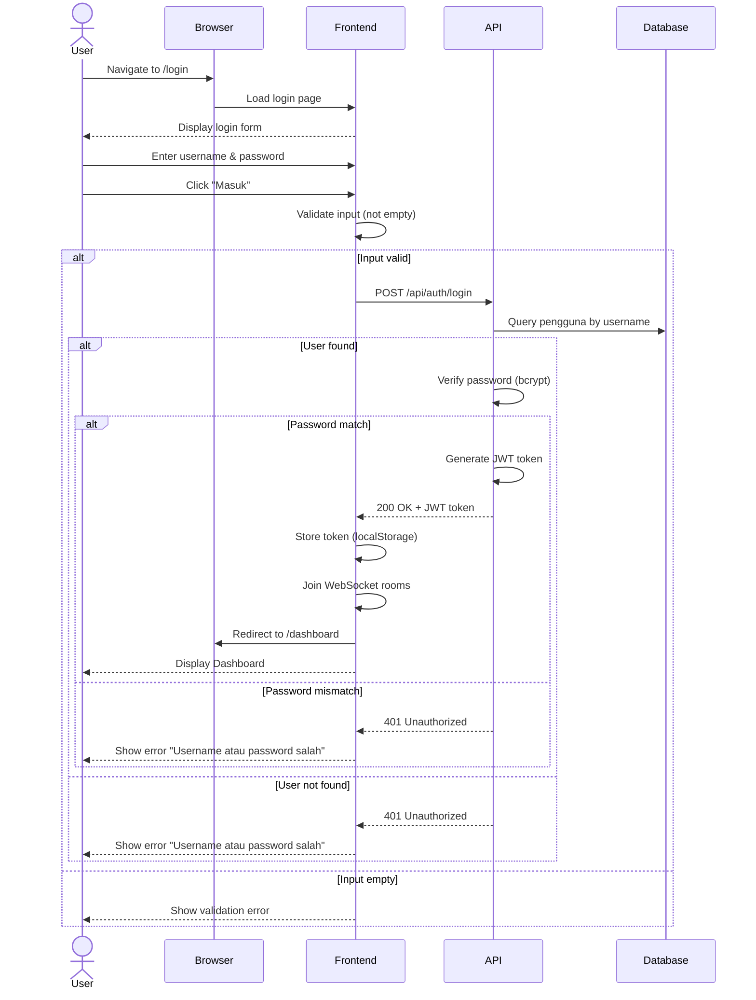

# System Logic: UC-001 User Login

Document Version: v1.0

Use Case ID: UC-001

Use Case Name: User Login

Status: Draft

Last Updated: 2026-06-28

Author: System Analyst AI

---

## 1. Overview

This document defines the system logic for user authentication, including sequence diagrams and API contracts.

---

## 2. Related Screens

| Screen | Route | Description |
|---|---|---|
| Login Page | `/login` | Form input username & password |
| Dashboard | `/dashboard` | Halaman tujuan setelah login berhasil |

---

## 3. Related Entities

| Entity | Table | Description |
|---|---|---|
| Pengguna | `pengguna` | Data akun pengguna (username, password, role, bidang) |

---

## 4. Sequence Diagram



---

## 5. API Contract

### 5.1 POST /api/auth/login

Authenticate user and create session.

**Request Headers:**

| Header | Value |
|---|---|
| Content-Type | application/json |

**Request Body:**

```json
{
  "username": "string (required)",
  "password": "string (required)"
}
```

**Request Example:**

```json
{
  "username": "admin",
  "password": "admin123"
}
```

**Success Response (200 OK):**

```json
{
  "success": true,
  "data": {
    "token": "eyJhbGciOiJIUzI1NiIs...",
    "user": {
      "id": "uuid",
      "username": "admin",
      "nama_lengkap": "Admin TU",
      "role": "ADMIN_TU",
      "bidang": null
    }
  },
  "message": "Login successful"
}
```

**Error Response (401 Unauthorized):**

```json
{
  "success": false,
  "data": null,
  "message": "Username atau password salah",
  "errors": []
}
```

**Error Response (400 Bad Request):**

```json
{
  "success": false,
  "data": null,
  "message": "Validation failed",
  "errors": [
    {
      "field": "username",
      "message": "Username harus diisi"
    },
    {
      "field": "password",
      "message": "Password harus diisi"
    }
  ]
}
```

---

### 5.2 POST /api/auth/logout

Logout pengguna dan hapus token dari client.

**Request Headers:**

| Header | Value |
|---|---|
| Authorization | Bearer <jwt_token> |

**Success Response (200 OK):**

```json
{
  "success": true,
  "data": null,
  "message": "Logout successful"
}
```

**Client Action on Logout:**
1. Remove JWT token from localStorage
2. Disconnect WebSocket connection
3. Redirect to `/login`

---

### 5.3 GET /api/auth/profile

Get current authenticated user info.

**Request Headers:**

| Header | Value |
|---|---|
| Authorization | Bearer <jwt_token> |

**Success Response (200 OK):**

```json
{
  "success": true,
  "data": {
    "id": "uuid",
    "username": "admin",
    "nama_lengkap": "Admin TU",
    "role": "ADMIN_TU",
    "bidang": null,
    "is_active": true,
    "created_at": "2026-06-28T00:00:00Z"
  },
  "message": "Success"
}
```

**Error Response (401 Unauthorized):**

```json
{
  "success": false,
  "data": null,
  "message": "Token tidak valid",
  "errors": []
}
```

---

## 6. Data Flow

| Step | Input | Process | Output |
|---|---|---|---|
| 1 | Username, Password | Frontend validation | Validated input |
| 2 | Validated credentials | API authentication | JWT token |
| 3 | JWT token | localStorage storage | Token tersimpan |
| 4 | Token | WebSocket connection | Rooms joined |

---

## 7. Validation Rules

| Field | Rule | Error Message |
|---|---|---|
| username | Required, tidak boleh kosong | "Username harus diisi" |
| password | Required, tidak boleh kosong | "Password harus diisi" |
| username | Harus ada di database | "Username atau password salah" |
| password | Harus match dengan bcrypt hash | "Username atau password salah" |

---

## 8. Security Rules

| Rule | Description |
|---|---|
| Password Hashing | Password di-hash menggunakan bcrypt dengan salt rounds >= 10 |
| JWT Token | Token di-generate dengan secret key dari env JWT_SECRET |
| Token Storage | Token disimpan di localStorage (BR-14: hanya JWT yang boleh di localStorage) |
| Token Expiry | Token expired sesuai konfigurasi JWT |

---

## 9. Business Rules Reference

| Code | Rule |
|---|---|
| BR-01 | Setiap pengguna wajib login menggunakan username dan password |
| BR-14 | localStorage hanya boleh dipakai untuk menyimpan token sesi |

---

## 10. Traceability

| User Flow | Requirement | API Endpoint |
|---|---|---|
| userflow_uc_001.md | F-01, BR-01 | POST /api/auth/login |
