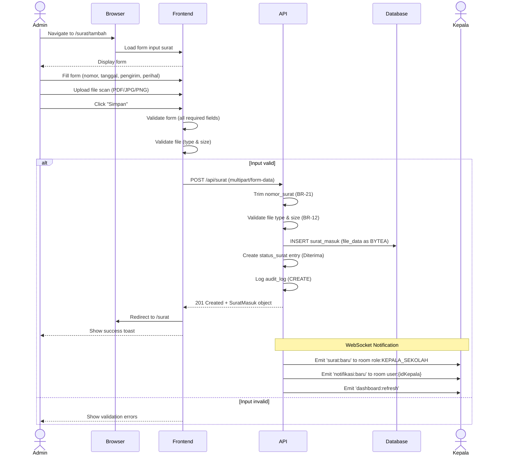

# System Logic: UC-002 Input Surat Masuk

Document Version: v1.0

Use Case ID: UC-002

Use Case Name: Input Surat Masuk

Status: Draft

Last Updated: 2026-06-28

Author: System Analyst AI

---

## 1. Overview

This document defines the system logic for inputting incoming letters with file upload to Neon database as BYTEA.

---

## 2. Related Screens

| Screen | Route | Description |
|---|---|---|
| Form Input Surat | `/surat/tambah` | Form input surat masuk baru |
| Daftar Surat | `/surat` | Tabel daftar surat masuk |

---

## 3. Related Entities

| Entity | Table | Description |
|---|---|---|
| Surat Masuk | `surat_masuk` | Data surat masuk + file scan BYTEA |
| Pengguna | `pengguna` | ID pembuat (Admin TU) |

---

## 4. Sequence Diagram



---

## 5. API Contract

### 5.1 POST /api/surat

Input surat masuk baru dengan file scan.

**Request Headers:**

| Header | Value |
|---|---|
| Authorization | Bearer <jwt_token> |
| Content-Type | multipart/form-data |

**Request Body (Form Data):**

| Field | Type | Required | Description |
|---|---|---|---|
| nomor_surat | string | Yes | Nomor surat (akan di-trim) |
| tanggal_diterima | date | Yes | Tanggal surat diterima |
| pengirim | string | Yes | Nama pengirim |
| perihal | string | Yes | Perihal/subject surat |
| file_scan | file | Yes | File scan (PDF/JPG/PNG, max 10MB) |

**Request Example:**

```
nomor_surat: "001/SM9-YK/VI/2026"
tanggal_diterima: "2026-06-28"
pengirim: "Dinas Pendidikan Kota Yogyakarta"
perihal: "Undangan Rapat Koordinasi"
file_scan: [binary file]
```

**Success Response (201 Created):**

```json
{
  "success": true,
  "data": {
    "id": "uuid",
    "nomor_surat": "001/SM9-YK/VI/2026",
    "tanggal_diterima": "2026-06-28",
    "pengirim": "Dinas Pendidikan Kota Yogyakarta",
    "perihal": "Undangan Rapat Koordinasi",
    "file_scan": "001_SM9-YK_VI_2026.pdf",
    "status": "Diterima",
    "created_by": "uuid-admin",
    "created_at": "2026-06-28T10:00:00Z"
  },
  "message": "Surat masuk berhasil ditambahkan"
}
```

**Error Response (400 Bad Request):**

```json
{
  "success": false,
  "data": null,
  "message": "Validation failed",
  "errors": [
    {
      "field": "nomor_surat",
      "message": "Nomor surat sudah ada"
    }
  ]
}
```

**Error Response (400 Bad Request - File):**

```json
{
  "success": false,
  "data": null,
  "message": "File tidak valid",
  "errors": [
    {
      "field": "file_scan",
      "message": "Format file harus PDF, JPG, atau PNG"
    }
  ]
}
```

---

## 6. Data Mapping

| Frontend Field | Database Column | Transformation |
|---|---|---|
| nomor_surat | nomor_surat | TRIM spasi (BR-21) |
| tanggal_diterima | tanggal_diterima | Direct mapping |
| pengirim | pengirim | Direct mapping |
| perihal | perihal | Direct mapping |
| file_scan (name) | file_scan | Original filename |
| file_scan (binary) | file_data | Stored as BYTEA |
| file_scan (mime) | file_mime | MIME type detection |
| - | status | Default: 'Diterima' |
| - | created_by | From JWT token |

---

## 7. Validation Rules

| Field | Rule | Error Message |
|---|---|---|
| nomor_surat | Required, unique | "Nomor surat sudah ada" |
| nomor_surat | Will be trimmed | - |
| tanggal_diterima | Required, valid date | "Tanggal tidak valid" |
| pengirim | Required | "Pengirim harus diisi" |
| perihal | Required | "Perihal harus diisi" |
| file_scan | Required | "File harus diunggah" |
| file_scan | Type: PDF, JPG, PNG | "Format file harus PDF, JPG, atau PNG" |
| file_scan | Max size: 10MB | "Ukuran file maksimal 10MB" |

---

## 8. Business Rules Reference

| Code | Rule |
|---|---|
| BR-06 | Notifikasi otomatis dikirim ke Kepala Sekolah setiap ada surat masuk baru |
| BR-08 | Setiap perubahan status harus tercatat di tabel status_surat (event sourcing) |
| BR-12 | File scan hanya boleh berformat PDF atau gambar (JPG/PNG). Maksimal 10MB |
| BR-14 | Seluruh data tersimpan di Neon PostgreSQL (tidak ada localStorage untuk data) |
| BR-15 | Perubahan data wajib didorong secara realtime via WebSocket |
| BR-20 | File scan disimpan sebagai BYTEA di database Neon |
| BR-21 | Input nomor surat akan di-trim spasi di depan dan belakang |

---

## 9. WebSocket Events

| Event | Room | Payload |
|---|---|---|
| surat:baru | role:KEPALA_SEKOLAH | Object SuratMasuk lengkap |
| notifikasi:baru | user:{idKepala} | Object Notifikasi |
| dashboard:refresh | role:KEPALA_SEKOLAH, role:WAKASEK | Ringkasan dashboard |

---

## 10. Traceability

| User Flow | Requirement | API Endpoint |
|---|---|---|
| userflow_uc_002.md | F-03, BR-06, BR-08, BR-12, BR-14, BR-15, BR-20, BR-21 | POST /api/surat |
