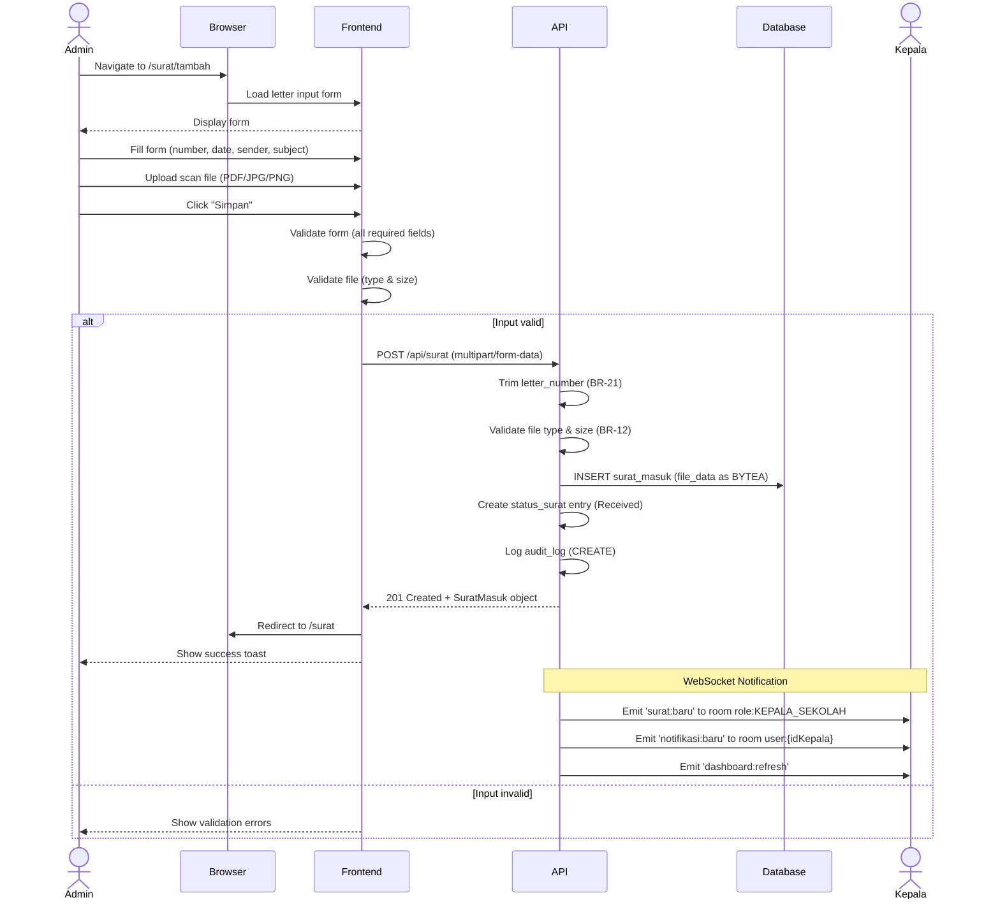

# System Logic: UC-002 Input Incoming Letter

Document Version: v1.0

Use Case ID: UC-002

Use Case Name: Input Incoming Letter

Status: Draft

Last Updated: 2026-06-28

Author: System Analyst AI

---

## 1. Overview

This document defines the system logic for incoming letter input with file upload to Neon database as BYTEA.

---

## 2. Related Pages

| Page | Route | Description |
|---|---|---|
| Letter Input Form | `/surat/tambah` | New incoming letter input form |
| Letter List | `/surat` | Incoming letter list table |

---

## 3. Related Entities

| Entity | Table | Description |
|---|---|---|
| Incoming Letter | `surat_masuk` | Incoming letter data + BYTEA scan file |
| User | `pengguna` | Creator ID (Admin TU) |

---

## 4. Sequence Diagram



---

## 5. API Contract

### 5.1 POST /api/surat

Input new incoming letter with scan file.

**Request Headers:**

| Header | Value |
|---|---|
| Authorization | Bearer <jwt_token> |
| Content-Type | multipart/form-data |

**Request Body (Form Data):**

| Column | Type | Required | Description |
|---|---|---|---|
| nomor_surat | string | Yes | Letter number (will be trimmed) |
| tanggal_diterima | date | Yes | Date letter was received |
| pengirim | string | Yes | Sender name |
| perihal | string | Yes | Letter subject |
| file_scan | file | Yes | Scan file (PDF/JPG/PNG, max 10MB) |

**Request Example:**

```
nomor_surat: "001/SM9-YK/VI/2026"
tanggal_diterima: "2026-06-28"
pengirim: "Dinas Pendidikan Kota Yogyakarta"
perihal: "Undangan Rapat Koordinasi"
file_scan: [binary file]
```

**Success Response (201 Created):**

```json
{
  "success": true,
  "data": {
    "id": "uuid",
    "nomor_surat": "001/SM9-YK/VI/2026",
    "tanggal_diterima": "2026-06-28",
    "pengirim": "Dinas Pendidikan Kota Yogyakarta",
    "perihal": "Undangan Rapat Koordinasi",
    "file_scan": "001_SM9-YK_VI_2026.pdf",
    "status": "Diterima",
    "created_by": "uuid-admin",
    "created_at": "2026-06-28T10:00:00Z"
  },
  "message": "Incoming letter added successfully"
}
```

**Error Response (400 Bad Request):**

```json
{
  "success": false,
  "data": null,
  "message": "Validation failed",
  "errors": [
    {
      "field": "nomor_surat",
      "message": "Letter number already exists"
    }
  ]
}
```

**Error Response (400 Bad Request - File):**

```json
{
  "success": false,
  "data": null,
  "message": "Invalid file",
  "errors": [
    {
      "field": "file_scan",
      "message": "File format must be PDF, JPG, or PNG"
    }
  ]
}
```

---

## 6. Data Flow

| Frontend Column | Database Column | Transformation |
|---|---|---|
| nomor_surat | nomor_surat | TRIM spaces (BR-21) |
| tanggal_diterima | tanggal_diterima | Direct mapping |
| pengirim | pengirim | Direct mapping |
| perihal | perihal | Direct mapping |
| file_scan (name) | file_scan | Original filename |
| file_scan (binary) | file_data | Stored as BYTEA |
| file_scan (mime) | file_mime | MIME type detection |
| - | status | Default: 'Diterima' |
| - | created_by | From JWT token |

---

## 7. Validation Rules

| Column | Rule | Error Message |
|---|---|---|
| nomor_surat | Required, unique | "Letter number already exists" |
| nomor_surat | Will be trimmed | - |
| tanggal_diterima | Required, valid date | "Invalid date" |
| pengirim | Required | "Sender is required" |
| perihal | Required | "Subject is required" |
| file_scan | Required | "File must be uploaded" |
| file_scan | Type: PDF, JPG, PNG | "File format must be PDF, JPG, or PNG" |
| file_scan | Max size: 10MB | "Maximum file size is 10MB" |

---

## 8. Security Rules

| Rule | Description |
|---|---|
| Authentication | JWT authentication required |
| Authorization | Only Admin TU can create incoming letters (BR-04) |
| File Size Limit | Max 10MB per file (BR-12) |
| File Type Restriction | Only PDF, JPG, PNG allowed (BR-12) |

---

## 9. Business Rule References

| Code | Rule |
|---|---|
| BR-06 | Automatic notification sent to Principal whenever new incoming letter arrives |
| BR-08 | Every status change must be recorded in status_surat table (event sourcing) |
| BR-12 | Scan files may only be PDF or image (JPG/PNG). Maximum 10MB |
| BR-14 | All data stored in Neon PostgreSQL (no localStorage for data) |
| BR-15 | Data changes must be pushed in realtime via WebSocket |
| BR-20 | Scan files stored as BYTEA in Neon database |
| BR-21 | Input letter number will be trimmed of leading and trailing spaces |

---

## 10. WebSocket Events

| Event | Room | Payload |
|---|---|---|
| surat:baru | role:KEPALA_SEKOLAH | Complete SuratMasuk object |
| notifikasi:baru | user:{idKepala} | Notifikasi object |
| dashboard:refresh | role:KEPALA_SEKOLAH, role:WAKASEK | Dashboard summary |

---

## 11. Traceability

| User Flow | Requirement | API Endpoint |
|---|---|---|
| userflow_uc_002.md | F-03, BR-06, BR-08, BR-12, BR-14, BR-15, BR-20, BR-21 | POST /api/surat |