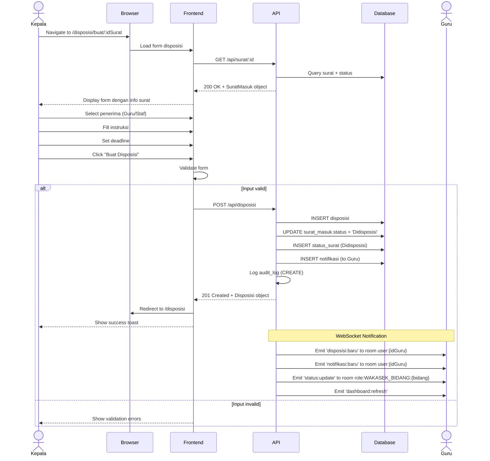

# System Logic: UC-003 Buat Disposisi Digital

Document Version: v1.0

Use Case ID: UC-003

Use Case Name: Buat Disposisi Digital

Status: Draft

Last Updated: 2026-06-28

Author: System Analyst AI

---

## 1. Overview

This document defines the system logic for creating digital disposisi by Kepala Sekolah.

---

## 2. Related Screens

| Screen | Route | Description |
|---|---|---|
| Form Buat Disposisi | `/disposisi/buat/:idSurat` | Form disposisi: pilih penerima, instruksi, deadline |
| Detail Surat | `/surat/:id` | Detail surat dengan tombol "Buat Disposisi" |

---

## 3. Related Entities

| Entity | Table | Description |
|---|---|---|
| Disposisi | `disposisi` | Data disposisi surat |
| Surat Masuk | `surat_masuk` | Surat yang didisposisikan |
| Pengguna | `pengguna` | Kepala Sekolah (pembuat) & Guru/Staf (penerima) |
| Notifikasi | `notifikasi` | Notifikasi ke penerima disposisi |

---

## 4. Sequence Diagram



---

## 5. API Contract

### 5.1 POST /api/disposisi

Buat disposisi baru.

**Request Headers:**

| Header | Value |
|---|---|
| Authorization | Bearer <jwt_token> |
| Content-Type | application/json |

**Request Body:**

```json
{
  "surat_id": "uuid (required)",
  "diberikan_kepada": "uuid (required)",
  "instruksi": "string (required)",
  "deadline": "date (required)"
}
```

**Request Example:**

```json
{
  "surat_id": "uuid-surat",
  "diberikan_kepada": "uuid-guru-kurikulum",
  "instruksi": "Mohon ditindaklanjuti undangan rapat koordinasi ini",
  "deadline": "2026-07-05"
}
```

**Success Response (201 Created):**

```json
{
  "success": true,
  "data": {
    "id": "uuid",
    "surat_id": "uuid-surat",
    "diberikan_oleh": "uuid-kepala",
    "diberikan_kepada": "uuid-guru",
    "instruksi": "Mohon ditindaklanjuti undangan rapat koordinasi ini",
    "deadline": "2026-07-05",
    "created_at": "2026-06-28T10:30:00Z",
    "surat": {
      "nomor_surat": "001/SM9-YK/VI/2026",
      "pengirim": "Dinas Pendidikan Kota Yogyakarta",
      "perihal": "Undangan Rapat Koordinasi"
    },
    "penerima": {
      "nama_lengkap": "Guru Kurikulum",
      "bidang": "Kurikulum"
    }
  },
  "message": "Disposisi berhasil dibuat"
}
```

**Error Response (400 Bad Request):**

```json
{
  "success": false,
  "data": null,
  "message": "Validation failed",
  "errors": [
    {
      "field": "diberikan_kepada",
      "message": "Penerima harus dipilih"
    }
  ]
}
```

---

## 6. Data Mapping

| Frontend Field | Database Column | Transformation |
|---|---|---|
| surat_id | surat_id | Direct mapping |
| diberikan_kepada | diberikan_kepada | Direct mapping |
| instruksi | instruksi | Direct mapping |
| deadline | deadline | Direct mapping |
| - | diberikan_oleh | From JWT token (Kepala) |
| - | status surat | Updated to 'Didisposisi' |

---

## 7. Validation Rules

| Field | Rule | Error Message |
|---|---|---|
| surat_id | Required, valid UUID | "Surat tidak valid" |
| diberikan_kepada | Required, must be GURU_STAF | "Penerima harus dipilih" |
| instruksi | Required, min 10 chars | "Instruksi harus diisi minimal 10 karakter" |
| deadline | Required, must be future date | "Deadline harus di masa depan" |

---

## 8. Business Rules Reference

| Code | Rule |
|---|---|
| BR-03 | Status surat berubah: Diterima → Didisposisi |
| BR-04 | Disposisi hanya dibuat oleh Kepala Sekolah |
| BR-05 | Satu surat dapat memiliki lebih dari satu disposisi |
| BR-07 | Notifikasi otomatis dikirim ke Guru/Staf setiap ada disposisi baru |
| BR-08 | Perubahan status tercatat di tabel status_surat |
| BR-15 | Perubahan data didorong secara realtime via WebSocket |

---

## 9. WebSocket Events

| Event | Room | Payload |
|---|---|---|
| disposisi:baru | user:{idGuru} | Object Disposisi lengkap |
| notifikasi:baru | user:{idGuru} | Object Notifikasi |
| status:update | role:WAKASEK_BIDANG:{bidang} | Status surat terbaru |
| dashboard:refresh | role:KEPALA_SEKOLAH, role:WAKASEK | Ringkasan dashboard |

---

## 10. Traceability

| User Flow | Requirement | API Endpoint |
|---|---|---|
| userflow_uc_003.md | F-04, BR-03, BR-04, BR-05, BR-07, BR-08, BR-15 | POST /api/disposisi |
