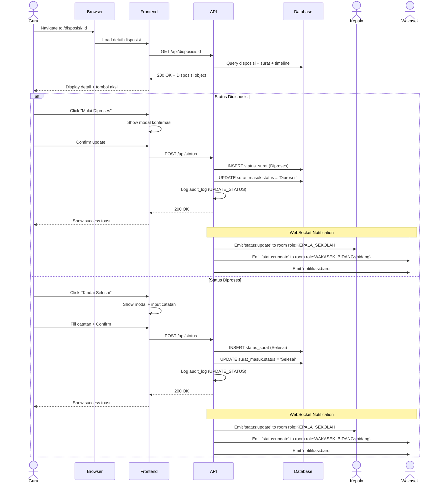

# System Logic: UC-004 Update Status Surat

Document Version: v1.0

Use Case ID: UC-004

Use Case Name: Update Status Surat (Tindak Lanjut & Selesai)

Status: Draft

Last Updated: 2026-06-28

Author: System Analyst AI

---

## 1. Overview

This document defines the system logic for updating letter status by Guru/Staf.

---

## 2. Related Screens

| Screen | Route | Description |
|---|---|---|
| Disposisi Saya | `/disposisi/saya` | Daftar disposisi yang diterima |
| Detail Disposisi | `/disposisi/:id` | Detail instruksi + tombol update status |

---

## 3. Related Entities

| Entity | Table | Description |
|---|---|---|
| Status Surat | `status_surat` | Riwayat perubahan status |
| Surat Masuk | `surat_masuk` | Status surat terkini |
| Disposisi | `disposisi` | Disposisi terkait |
| Notifikasi | `notifikasi` | Notifikasi ke Kepala & Wakasek |

---

## 4. Sequence Diagram



---

## 5. API Contract

### 5.1 POST /api/status

Update status surat (Tindak Lanjut / Selesai).

**Request Headers:**

| Header | Value |
|---|---|
| Authorization | Bearer <jwt_token> |
| Content-Type | application/json |

**Request Body:**

```json
{
  "surat_id": "uuid (required)",
  "status": "string (required: 'Diproses' atau 'Selesai')",
  "catatan": "string (optional)"
}
```

**Request Example (Mulai Diproses):**

```json
{
  "surat_id": "uuid-surat",
  "status": "Diproses",
  "catatan": "Surat sedang diproses"
}
```

**Request Example (Tandai Selesai):**

```json
{
  "surat_id": "uuid-surat",
  "status": "Selesai",
  "catatan": "Undangan sudah ditindaklanjuti"
}
```

**Success Response (200 OK):**

```json
{
  "success": true,
  "data": {
    "id": "uuid-status",
    "surat_id": "uuid-surat",
    "status": "Diproses",
    "catatan": "Surat sedang diproses",
    "diubah_oleh": "uuid-guru",
    "created_at": "2026-06-28T11:00:00Z"
  },
  "message": "Status berhasil diperbarui"
}
```

**Error Response (400 Bad Request):**

```json
{
  "success": false,
  "data": null,
  "message": "Status tidak valid",
  "errors": [
    {
      "field": "status",
      "message": "Status harus Diproses atau Selesai"
    }
  ]
}
```

---

## 6. Data Mapping

| Frontend Field | Database Column | Transformation |
|---|---|---|
| surat_id | surat_id | Direct mapping |
| status | status | Direct mapping |
| catatan | catatan | Direct mapping |
| - | diubah_oleh | From JWT token (Guru) |
| - | surat_masuk.status | Updated to new status |

---

## 7. Validation Rules

| Field | Rule | Error Message |
|---|---|---|
| surat_id | Required, valid UUID | "Surat tidak valid" |
| status | Must be 'Diproses' or 'Selesai' | "Status tidak valid" |
| catatan | Optional, max 500 chars | "Catatan terlalu panjang" |
| - | Status harus berurutan (BR-03) | "Status tidak boleh melompat" |

---

## 8. Business Rules Reference

| Code | Rule |
|---|---|
| BR-03 | Status hanya boleh berubah: Diterima → Didisposisi → Diproses → Selesai |
| BR-08 | Perubahan status tercatat di tabel status_surat (event sourcing) |
| BR-11 | Guru/Staf hanya dapat melihat surat yang didisposisikan kepadanya |
| BR-13 | Surat yang sudah Selesai tidak dapat diubah statusnya kembali |
| BR-15 | Perubahan data didorong secara realtime via WebSocket |

---

## 9. WebSocket Events

| Event | Room | Payload |
|---|---|---|
| status:update | role:KEPALA_SEKOLAH | Status surat terbaru |
| status:update | role:WAKASEK_BIDANG:{bidang} | Status surat terbaru |
| notifikasi:baru | user:{idKepala} | Object Notifikasi |
| notifikasi:baru | user:{idWakasek} | Object Notifikasi |
| dashboard:refresh | role:KEPALA_SEKOLAH, role:WAKASEK | Ringkasan dashboard |

---

## 10. Traceability

| User Flow | Requirement | API Endpoint |
|---|---|---|
| userflow_uc_004.md | F-05, BR-03, BR-08, BR-11, BR-13, BR-15 | POST /api/status |
