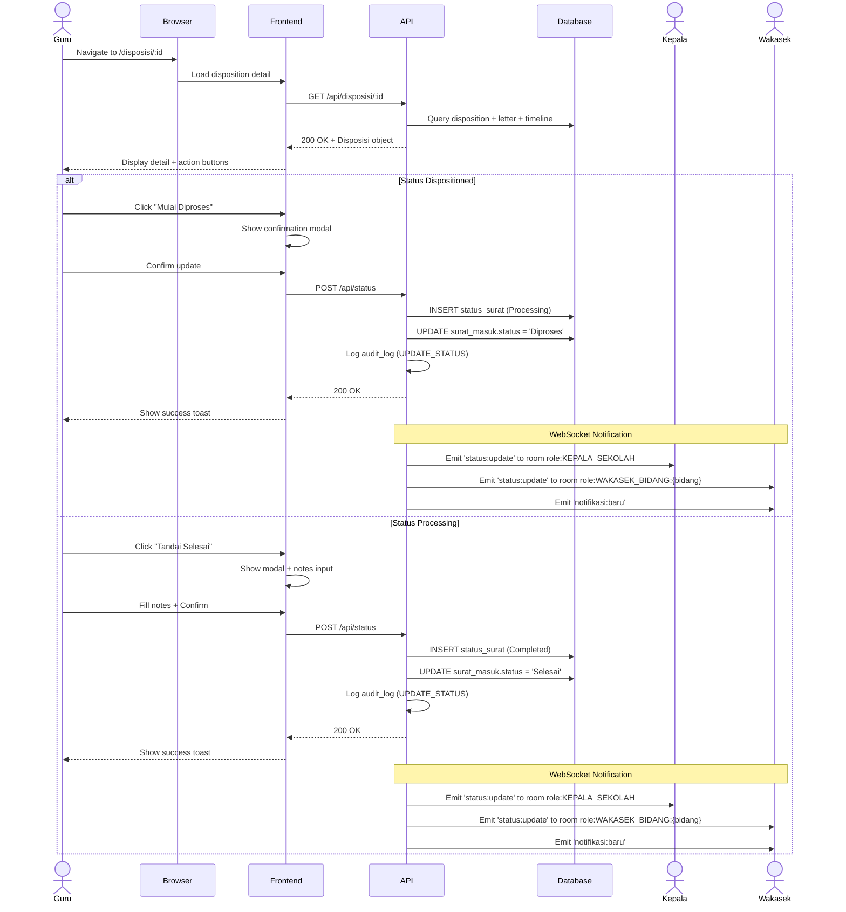

# System Logic: UC-004 Update Letter Status

Document Version: v1.0

Use Case ID: UC-004

Use Case Name: Update Letter Status (Follow-up & Completed)

Status: Draft

Last Updated: 2026-06-28

Author: System Analyst AI

---

## 1. Overview

This document defines the system logic for updating letter status by Teacher/Staff.

---

## 2. Related Pages

| Page | Route | Description |
|---|---|---|
| My Dispositions | `/disposisi/saya` | List of received dispositions |
| Disposition Detail | `/disposisi/:id` | Instruction detail + status update button |

---

## 3. Related Entities

| Entity | Table | Description |
|---|---|---|
| Letter Status | `status_surat` | Status change history |
| Incoming Letter | `surat_masuk` | Current letter status |
| Disposition | `disposisi` | Related disposition |
| Notification | `notifikasi` | Notification to Principal & Vice Principal |

---

## 4. Sequence Diagram



---

## 5. API Contract

### 5.1 POST /api/status

Update letter status (Follow-up / Completed).

**Request Headers:**

| Header | Value |
|---|---|
| Authorization | Bearer <jwt_token> |
| Content-Type | application/json |

**Request Body:**

```json
{
  "surat_id": "uuid (required)",
  "status": "string (required: 'Diproses' or 'Selesai')",
  "catatan": "string (optional)"
}
```

**Request Example (Start Processing):**

```json
{
  "surat_id": "uuid-surat",
  "status": "Diproses",
  "catatan": "Surat sedang diproses"
}
```

**Request Example (Mark Completed):**

```json
{
  "surat_id": "uuid-surat",
  "status": "Selesai",
  "catatan": "Undangan sudah ditindaklanjuti"
}
```

**Success Response (200 OK):**

```json
{
  "success": true,
  "data": {
    "id": "uuid-status",
    "surat_id": "uuid-surat",
    "status": "Diproses",
    "catatan": "Surat sedang diproses",
    "diubah_oleh": "uuid-guru",
    "created_at": "2026-06-28T11:00:00Z"
  },
  "message": "Status updated successfully"
}
```

**Error Response (400 Bad Request):**

```json
{
  "success": false,
  "data": null,
  "message": "Invalid status",
  "errors": [
    {
      "field": "status",
      "message": "Status must be Diproses or Selesai"
    }
  ]
}
```

---

## 6. Data Flow

| Frontend Column | Database Column | Transformation |
|---|---|---|
| surat_id | surat_id | Direct mapping |
| status | status | Direct mapping |
| catatan | catatan | Direct mapping |
| - | diubah_oleh | From JWT token (Teacher) |
| - | surat_masuk.status | Updated to new status |

---

## 7. Validation Rules

| Column | Rule | Error Message |
|---|---|---|
| surat_id | Required, valid UUID | "Invalid letter" |
| status | Must be 'Diproses' or 'Selesai' | "Invalid status" |
| catatan | Optional, max 500 characters | "Notes too long" |
| - | Status must be sequential (BR-03) | "Status cannot skip steps" |

---

## 8. Security Rules

| Rule | Description |
|---|---|
| Authentication | JWT authentication required |
| Authorization | Only assigned Teacher/Staff can update status (BR-11) |
| Status Flow | Status must follow sequential flow: Dispositioned → Processing → Completed (BR-03) |

---

## 9. Business Rule References

| Code | Rule |
|---|---|
| BR-03 | Status may only change: Received → Dispositioned → Processing → Completed |
| BR-08 | Status changes recorded in status_surat table (event sourcing) |
| BR-11 | Teacher/Staff can only see letters disposed to them |
| BR-13 | Completed letters cannot have their status changed again |
| BR-15 | Data changes pushed in realtime via WebSocket |

---

## 10. WebSocket Events

| Event | Room | Payload |
|---|---|---|
| status:update | role:KEPALA_SEKOLAH | Latest letter status |
| status:update | role:WAKASEK_BIDANG:{bidang} | Latest letter status |
| notifikasi:baru | user:{idKepala} | Notifikasi object |
| notifikasi:baru | user:{idWakasek} | Notifikasi object |
| dashboard:refresh | role:KEPALA_SEKOLAH, role:WAKASEK | Dashboard summary |

---

## 11. Traceability

| User Flow | Requirement | API Endpoint |
|---|---|---|
| userflow_uc_004.md | F-05, BR-03, BR-08, BR-11, BR-13, BR-15 | POST /api/status |