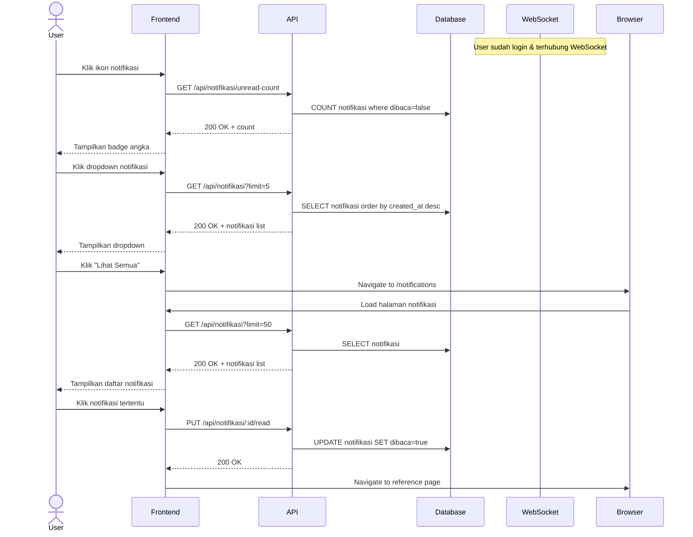

# System Logic: UC-005 Terima & Lihat Notifikasi

Document Version: v1.0

Use Case ID: UC-005

Use Case Name: Terima & Lihat Notifikasi

Status: Draft

Last Updated: 2026-06-28

Author: System Analyst AI

---

## 1. Overview

This document defines the system logic for receiving and viewing notifications via WebSocket.

---

## 2. Related Screens

| Screen | Route | Description |
|---|---|---|
| Topbar | - | Ikon notifikasi dengan badge |
| Dropdown Notif | - | Daftar 5 notif terbaru |
| Halaman Notifikasi | `/notifications` | Daftar seluruh notifikasi |

---

## 3. Related Entities

| Entity | Table | Description |
|---|---|---|
| Notifikasi | `notifikasi` | Data notifikasi internal |

---

## 4. Sequence Diagram



---

## 5. API Contract

### 5.1 GET /api/notifikasi

Daftar notifikasi pengguna.

**Request Headers:**

| Header | Value |
|---|---|
| Authorization | Bearer <jwt_token> |

**Query Params:**

| Param | Type | Default | Description |
|---|---|---|---|
| limit | number | 20 | Jumlah notifikasi |

**Success Response (200 OK):**

```json
{
  "success": true,
  "data": [
    {
      "id": "uuid",
      "user_id": "uuid",
      "judul": "Surat Baru",
      "pesan": "Ada surat baru dari Dinas Pendidikan",
      "tipe": "surat_baru",
      "reference_id": "uuid-surat",
      "dibaca": false,
      "created_at": "2026-06-28T10:00:00Z"
    }
  ],
  "message": "Success"
}
```

---

### 5.2 GET /api/notifikasi/unread-count

Jumlah notifikasi belum dibaca.

**Request Headers:**

| Header | Value |
|---|---|
| Authorization | Bearer <jwt_token> |

**Success Response (200 OK):**

```json
{
  "success": true,
  "data": {
    "count": 3
  },
  "message": "Success"
}
```

---

### 5.3 PUT /api/notifikasi/:id/read

Tandai notifikasi sudah dibaca.

**Request Headers:**

| Header | Value |
|---|---|
| Authorization | Bearer <jwt_token> |

**Success Response (200 OK):**

```json
{
  "success": true,
  "data": null,
  "message": "Notifikasi ditandai sudah dibaca"
}
```

---

### 5.4 PUT /api/notifikasi/read-all

Tandai semua notifikasi sudah dibaca.

**Request Headers:**

| Header | Value |
|---|---|
| Authorization | Bearer <jwt_token> |

**Success Response (200 OK):**

```json
{
  "success": true,
  "data": null,
  "message": "Semua notifikasi ditandai sudah dibaca"
}
```

---

## 6. WebSocket Events (Incoming)

| Event | Room | Payload | Description |
|---|---|---|---|
| notifikasi:baru | user:{id} | Object Notifikasi | Notifikasi baru diterima |

**Client Action on Event:**
1. Increment badge count
2. Add notifikasi to top of list
3. Play bounce animation on bell icon

---

## 7. Traceability

| User Flow | Requirement | API Endpoint |
|---|---|---|
| userflow_uc_005.md | F-06, BR-06, BR-07, BR-15 | GET/PUT /api/notifikasi |
