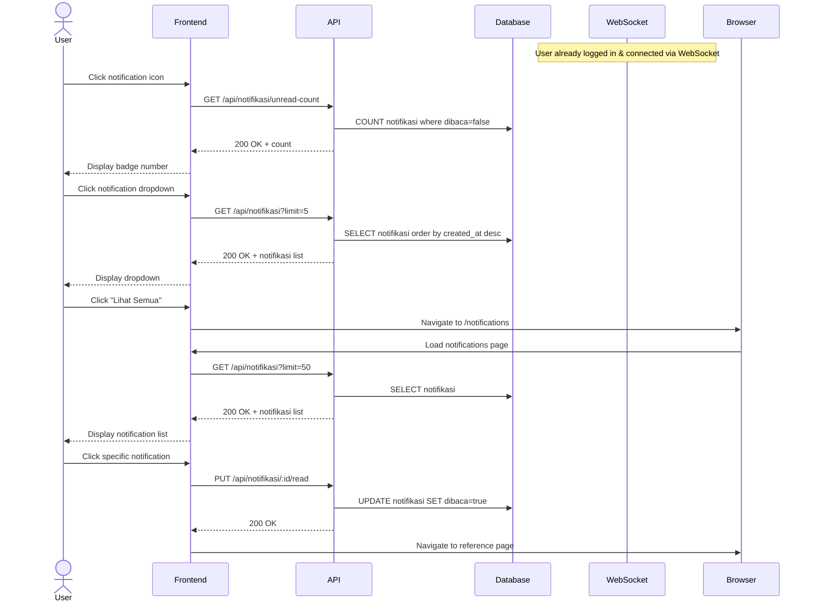

# System Logic: UC-005 Receive & View Notifications

Document Version: v1.0

Use Case ID: UC-005

Use Case Name: Receive & View Notifications

Status: Draft

Last Updated: 2026-06-28

Author: System Analyst AI

---

## 1. Overview

This document defines the system logic for receiving and viewing notifications via WebSocket.

---

## 2. Related Pages

| Page | Route | Description |
|---|---|---|
| Topbar | - | Notification icon with badge |
| Notification Dropdown | - | List of 5 latest notifications |
| Notifications Page | `/notifications` | List of all notifications |

---

## 3. Related Entities

| Entity | Table | Description |
|---|---|---|
| Notification | `notifikasi` | Internal notification data |

---

## 4. Sequence Diagram



---

## 5. API Contract

### 5.1 GET /api/notifikasi

List user notifications.

**Request Headers:**

| Header | Value |
|---|---|
| Authorization | Bearer <jwt_token> |

**Query Params:**

| Param | Type | Default | Description |
|---|---|---|---|
| limit | number | 20 | Number of notifications |

**Success Response (200 OK):**

```json
{
  "success": true,
  "data": [
    {
      "id": "uuid",
      "user_id": "uuid",
      "judul": "New Letter",
      "pesan": "There is a new letter from Dinas Pendidikan",
      "tipe": "surat_baru",
      "reference_id": "uuid-surat",
      "dibaca": false,
      "created_at": "2026-06-28T10:00:00Z"
    }
  ],
  "message": "Success"
}
```

---

### 5.2 GET /api/notifikasi/unread-count

Unread notification count.

**Request Headers:**

| Header | Value |
|---|---|
| Authorization | Bearer <jwt_token> |

**Success Response (200 OK):**

```json
{
  "success": true,
  "data": {
    "count": 3
  },
  "message": "Success"
}
```

---

### 5.3 PUT /api/notifikasi/:id/read

Mark notification as read.

**Request Headers:**

| Header | Value |
|---|---|
| Authorization | Bearer <jwt_token> |

**Success Response (200 OK):**

```json
{
  "success": true,
  "data": null,
  "message": "Notification marked as read"
}
```

---

### 5.4 PUT /api/notifikasi/read-all

Mark all notifications as read.

**Request Headers:**

| Header | Value |
|---|---|
| Authorization | Bearer <jwt_token> |

**Success Response (200 OK):**

```json
{
  "success": true,
  "data": null,
  "message": "All notifications marked as read"
}
```

---

## 10. WebSocket Events

| Event | Room | Payload | Description |
|---|---|---|---|
| notifikasi:baru | user:{id} | Notifikasi object | New notification received |

**Client Actions on Event:**
1. Increment badge count
2. Add notification to top of list
3. Play bounce animation on bell icon

---

## 6. Data Flow

Notifications are created by the system (on new letter or new disposition) and saved to the `notifikasi` table. The server sends a WebSocket `notifikasi:baru` event to the matching `user:{id}` room. The frontend receives the event, displays the notification in real-time, and manages the badge state (unread count). When the user marks a notification as read, a `PUT /api/notifikasi/:id/read` request updates the `dibaca` column in the database.

---

## 7. Validation Rules

| Rule | Description |
|---|---|
| Query param `limit` must be a positive integer | Value must be > 0, if invalid use default (20) |
| Query param `offset` must be a non-negative integer | Value must be >= 0, if invalid use default (0) |
| Param `:id` must be a valid UUID | UUID v4 format, if invalid return 400 Bad Request |

---

## 8. Security Rules

| Rule | Description |
|---|---|
| JWT authentication required | All endpoints require `Authorization: Bearer <jwt>` header |
| Notifications restricted to authenticated user only | Notification queries always filtered by `user_id` from JWT, cannot access other users' notifications |

---

## 9. Business Rule References

| Code | Rule |
|---|---|
| BR-06 | Automatic notification sent to Principal when new incoming letter arrives |
| BR-07 | Automatic notification sent to Teacher/Staff when new disposition arrives |
| BR-15 | Data changes pushed in realtime via WebSocket |

---

## 11. Traceability

| User Flow | Requirement | API Endpoint |
|---|---|---|
| userflow_uc_005.md | F-06, BR-06, BR-07, BR-15 | GET/PUT /api/notifikasi |