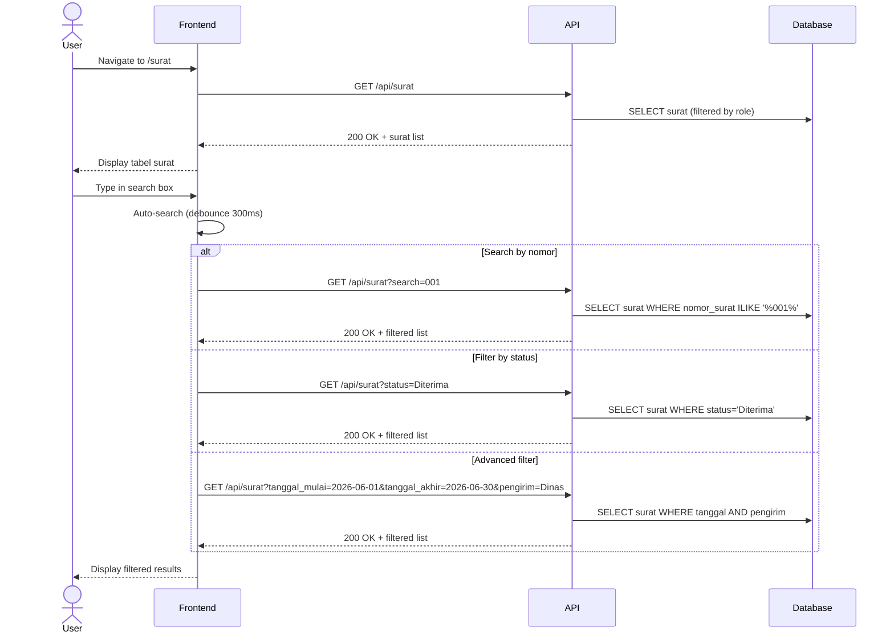

# System Logic: UC-006 Pencarian Lanjutan

Document Version: v1.0

Use Case ID: UC-006

Use Case Name: Pencarian Lanjutan

Status: Draft

Last Updated: 2026-06-28

Author: System Analyst AI

---

## 1. Overview

This document defines the system logic for searching and filtering letters.

---

## 2. Related Screens

| Screen | Route | Description |
|---|---|---|
| Daftar Surat | `/surat` | Tabel surat dengan filter & pencarian |

---

## 3. Related Entities

| Entity | Table | Description |
|---|---|---|
| Surat Masuk | `surat_masuk` | Data surat yang dicari |

---

## 4. Sequence Diagram



---

## 5. API Contract

### 5.1 GET /api/surat

Daftar surat dengan filter & pencarian.

**Request Headers:**

| Header | Value |
|---|---|
| Authorization | Bearer <jwt_token> |

**Query Params:**

| Param | Type | Description |
|---|---|---|
| search | string | Pencarian nomor surat |
| status | string | Filter status (Diterima/Didisposisi/Diproses/Selesai) |
| tanggal_mulai | date | Filter tanggal mulai |
| tanggal_akhir | date | Filter tanggal akhir |
| pengirim | string | Filter pengirim (ILIKE) |
| perihal | string | Filter perihal (ILIKE) |
| page | number | Halaman (default: 1) |
| limit | number | Limit per halaman (default: 10) |

**Success Response (200 OK):**

```json
{
  "success": true,
  "data": {
    "surat": [
      {
        "id": "uuid",
        "nomor_surat": "001/SM9-YK/VI/2026",
        "tanggal_diterima": "2026-06-28",
        "pengirim": "Dinas Pendidikan Kota Yogyakarta",
        "perihal": "Undangan Rapat Koordinasi",
        "status": "Diterima",
        "created_by": "uuid-admin",
        "created_at": "2026-06-28T10:00:00Z"
      }
    ],
    "pagination": {
      "total": 50,
      "page": 1,
      "limit": 10,
      "totalPages": 5
    }
  },
  "message": "Success"
}
```

---

## 6. Traceability

| User Flow | Requirement | API Endpoint |
|---|---|---|
| userflow_uc_006.md | F-07, F-14, BR-11 | GET /api/surat |
