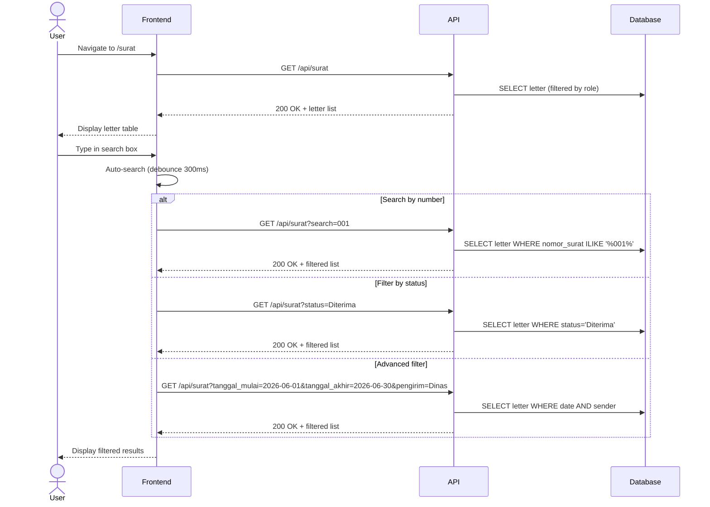

# System Logic: UC-006 Advanced Search

Document Version: v1.0

Use Case ID: UC-006

Use Case Name: Advanced Search

Status: Draft

Last Updated: 2026-06-28

Author: System Analyst AI

---

## 1. Overview

This document defines the system logic for letter search and filtering.

---

## 2. Related Pages

| Page | Route | Description |
|---|---|---|
| Letter List | `/surat` | Letter table with filters & search |

---

## 3. Related Entities

| Entity | Table | Description |
|---|---|---|
| Incoming Letter | `surat_masuk` | Letter data being searched |

---

## 4. Sequence Diagram



---

## 5. API Contract

### 5.1 GET /api/surat

Letter list with filters & search.

**Request Headers:**

| Header | Value |
|---|---|
| Authorization | Bearer <jwt_token> |

**Query Params:**

| Param | Type | Description |
|---|---|---|
| search | string | Letter number search |
| status | string | Status filter (Received/Dispositioned/Processing/Completed) |
| tanggal_mulai | date | Start date filter |
| tanggal_akhir | date | End date filter |
| pengirim | string | Sender filter (ILIKE) |
| perihal | string | Subject filter (ILIKE) |
| page | number | Page (default: 1) |
| limit | number | Limit per page (default: 10) |

**Success Response (200 OK):**

```json
{
  "success": true,
  "data": {
    "surat": [
      {
        "id": "uuid",
        "nomor_surat": "001/SM9-YK/VI/2026",
        "tanggal_diterima": "2026-06-28",
        "pengirim": "Dinas Pendidikan Kota Yogyakarta",
        "perihal": "Undangan Rapat Koordinasi",
        "status": "Diterima",
        "created_by": "uuid-admin",
        "created_at": "2026-06-28T10:00:00Z"
      }
    ],
    "pagination": {
      "total": 50,
      "page": 1,
      "limit": 10,
      "totalPages": 5
    }
  },
  "message": "Success"
}
```

---

## 6. Data Flow

Search and filter parameters are sent from the frontend as query params to the `GET /api/surat` endpoint. The backend builds the SQL query dynamically based on the given parameters: `search` is applied as `ILIKE` on the `nomor_surat` column, `status` as exact match, `tanggal_mulai`/`tanggal_akhir` as range on `tanggal_diterima`, and `pengirim`/`perihal` as `ILIKE`. The query result is returned with pagination metadata (total, page, limit, totalPages).

---

## 7. Validation Rules

| Rule | Description |
|---|---|
| Query params `tanggal_mulai`, `tanggal_akhir` must be valid date format (YYYY-MM-DD) | If format is invalid, return 400 Bad Request |
| Query params `pengirim`, `perihal` are strings, sanitized for ILIKE | Input sanitized to prevent SQL injection on ILIKE operations |
| `status` must be one of: Received, Dispositioned, Processing, Completed | If status is invalid, return 400 Bad Request |

---

## 8. Security Rules

| Rule | Description |
|---|---|
| JWT authentication required | Endpoint requires `Authorization: Bearer <jwt>` header |
| Teacher/Staff only see letters disposed to them (BR-11) | Query always filtered by role: Teacher/Staff only see letters with dispositions directed to them |
| Vice Principal only sees department letters (BR-10) | Query always filtered by department managed by Vice Principal |

---

## 9. Business Rule References

| Code | Rule |
|---|---|
| BR-10 | Vice Principal only sees letters within their department |
| BR-11 | Teacher/Staff only see letters disposed to them |

---

## 11. Traceability

| User Flow | Requirement | API Endpoint |
|---|---|---|
| userflow_uc_006.md | F-07, F-14, BR-11 | GET /api/surat |