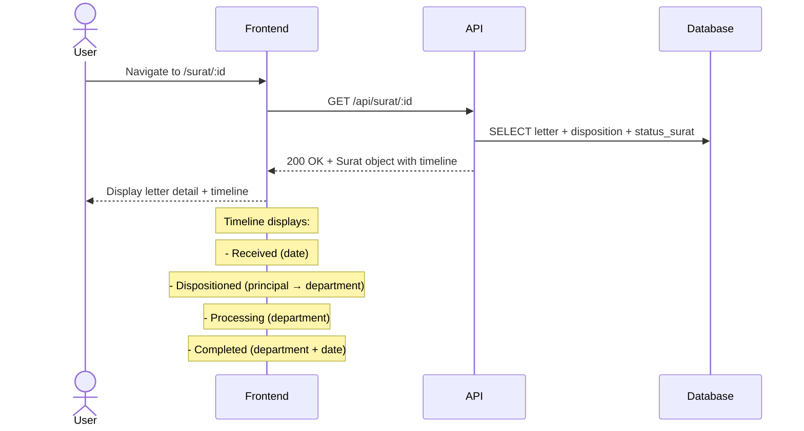

# System Logic: UC-007 View Letter Timeline

Document Version: v1.0

Use Case ID: UC-007

Use Case Name: View Letter Timeline

Status: Draft

Last Updated: 2026-06-28

Author: System Analyst AI

---

## 1. Overview

This document defines the system logic for viewing letter timeline (event sourcing).

---

## 2. Related Pages

| Page | Route | Description |
|---|---|---|
| Letter Detail | `/surat/:id` | Letter detail + history timeline |

---

## 3. Related Entities

| Entity | Table | Description |
|---|---|---|
| Letter Status | `status_surat` | Status change history |
| Incoming Letter | `surat_masuk` | Letter data |

---

## 4. Sequence Diagram



---

## 5. API Contract

### 5.1 GET /api/surat/:id

Letter detail + timeline.

**Request Headers:**

| Header | Value |
|---|---|
| Authorization | Bearer <jwt_token> |

**Success Response (200 OK):**

```json
{
  "success": true,
  "data": {
    "id": "uuid",
    "nomor_surat": "001/SM9-YK/VI/2026",
    "tanggal_diterima": "2026-06-28",
    "pengirim": "Dinas Pendidikan Kota Yogyakarta",
    "perihal": "Undangan Rapat Koordinasi",
    "file_scan": "001_SM9-YK_VI_2026.pdf",
    "status": "Didisposisi",
    "created_by": "uuid-admin",
    "created_at": "2026-06-28T10:00:00Z",
    "disposisi": [
      {
        "id": "uuid",
        "diberikan_oleh": {
          "nama_lengkap": "Kepala Sekolah",
          "role": "KEPALA_SEKOLAH"
        },
        "diberikan_kepada": {
          "nama_lengkap": "Guru Kurikulum",
          "bidang": "Kurikulum"
        },
        "instruksi": "Mohon ditindaklanjuti",
        "deadline": "2026-07-05"
      }
    ],
    "timeline": [
      {
        "status": "Diterima",
        "catatan": null,
        "diubah_oleh": "Admin TU",
        "created_at": "2026-06-28T10:00:00Z"
      },
      {
        "status": "Didisposisi",
        "catatan": null,
        "diubah_oleh": "Kepala Sekolah → Kurikulum",
        "created_at": "2026-06-28T10:30:00Z"
      }
    ],
    "komentar": [
      {
        "id": "uuid",
        "isi": "Sudah saya terima",
        "user": {
          "nama_lengkap": "Guru Kurikulum",
          "role": "GURU_STAF"
        },
        "created_at": "2026-06-28T11:00:00Z"
      }
    ]
  },
  "message": "Success"
}
```

---

## 6. Data Flow

Letter data is fetched from the `surat_masuk` table by `:id`. Status history is retrieved from the `status_surat` table filtered by matching `surat_id`, sorted by `created_at` ascending to form a chronological timeline. Both datasets are joined on the backend and sent as a single JSON object: the `timeline` field contains the status history array, the `disposisi` field contains the disposition history, and the `komentar` field contains comments related to the letter.

---

## 7. Validation Rules

| Rule | Description |
|---|---|
| Param `:id` must be a valid UUID | UUID v4 format, if invalid return 400 Bad Request |

---

## 8. Security Rules

| Rule | Description |
|---|---|
| JWT authentication required | Endpoint requires `Authorization: Bearer <jwt>` header |
| Teacher/Staff only see letters disposed to them (BR-11) | If role is GURU_STAF, backend verifies letter has disposition directed to that user |

---

## 9. Business Rule References

| Code | Rule |
|---|---|
| BR-08 | Every status change is recorded in status_surat table (event sourcing) |

---

## 11. Traceability

| User Flow | Requirement | API Endpoint |
|---|---|---|
| userflow_uc_007.md | F-08, BR-08 | GET /api/surat/:id |