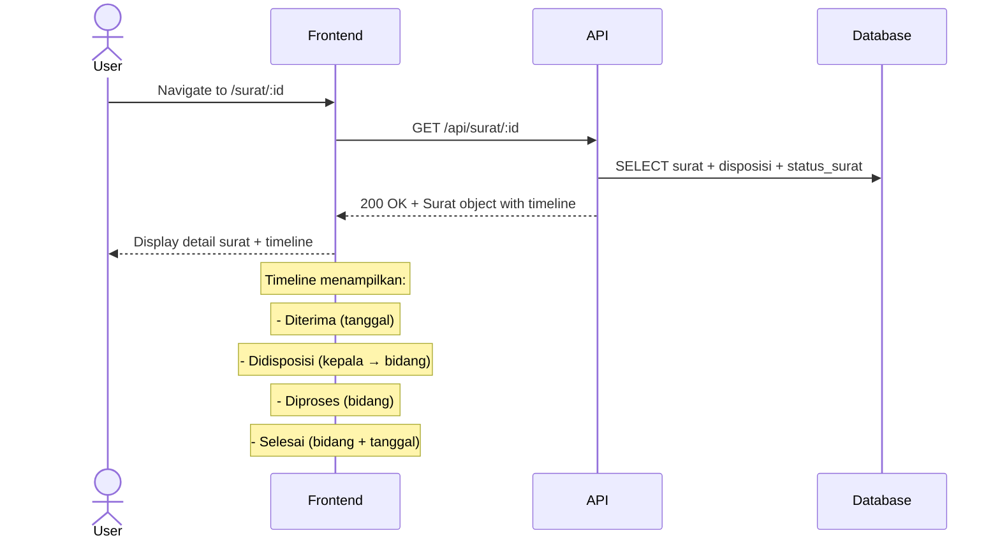

# System Logic: UC-007 Lihat Timeline Surat

Document Version: v1.0

Use Case ID: UC-007

Use Case Name: Lihat Timeline Surat

Status: Draft

Last Updated: 2026-06-28

Author: System Analyst AI

---

## 1. Overview

This document defines the system logic for viewing letter timeline (event sourcing).

---

## 2. Related Screens

| Screen | Route | Description |
|---|---|---|
| Detail Surat | `/surat/:id` | Detail surat + timeline riwayat |

---

## 3. Related Entities

| Entity | Table | Description |
|---|---|---|
| Status Surat | `status_surat` | Riwayat perubahan status |
| Surat Masuk | `surat_masuk` | Data surat |

---

## 4. Sequence Diagram



---

## 5. API Contract

### 5.1 GET /api/surat/:id

Detail surat + timeline.

**Request Headers:**

| Header | Value |
|---|---|
| Authorization | Bearer <jwt_token> |

**Success Response (200 OK):**

```json
{
  "success": true,
  "data": {
    "id": "uuid",
    "nomor_surat": "001/SM9-YK/VI/2026",
    "tanggal_diterima": "2026-06-28",
    "pengirim": "Dinas Pendidikan Kota Yogyakarta",
    "perihal": "Undangan Rapat Koordinasi",
    "file_scan": "001_SM9-YK_VI_2026.pdf",
    "status": "Didisposisi",
    "created_by": "uuid-admin",
    "created_at": "2026-06-28T10:00:00Z",
    "disposisi": [
      {
        "id": "uuid",
        "diberikan_oleh": {
          "nama_lengkap": "Kepala Sekolah",
          "role": "KEPALA_SEKOLAH"
        },
        "diberikan_kepada": {
          "nama_lengkap": "Guru Kurikulum",
          "bidang": "Kurikulum"
        },
        "instruksi": "Mohon ditindaklanjuti",
        "deadline": "2026-07-05"
      }
    ],
    "timeline": [
      {
        "status": "Diterima",
        "catatan": null,
        "diubah_oleh": "Admin TU",
        "created_at": "2026-06-28T10:00:00Z"
      },
      {
        "status": "Didisposisi",
        "catangan": null,
        "diubah_oleh": "Kepala Sekolah → Kurikulum",
        "created_at": "2026-06-28T10:30:00Z"
      }
    ],
    "komentar": [
      {
        "id": "uuid",
        "isi": "Sudah saya terima",
        "user": {
          "nama_lengkap": "Guru Kurikulum",
          "role": "GURU_STAF"
        },
        "created_at": "2026-06-28T11:00:00Z"
      }
    ]
  },
  "message": "Success"
}
```

---

## 6. Business Rules Reference

| Code | Rule |
|---|---|
| BR-08 | Setiap perubahan status tercatat di tabel status_surat (event sourcing) |

---

## 7. Traceability

| User Flow | Requirement | API Endpoint |
|---|---|---|
| userflow_uc_007.md | F-08, BR-08 | GET /api/surat/:id |
