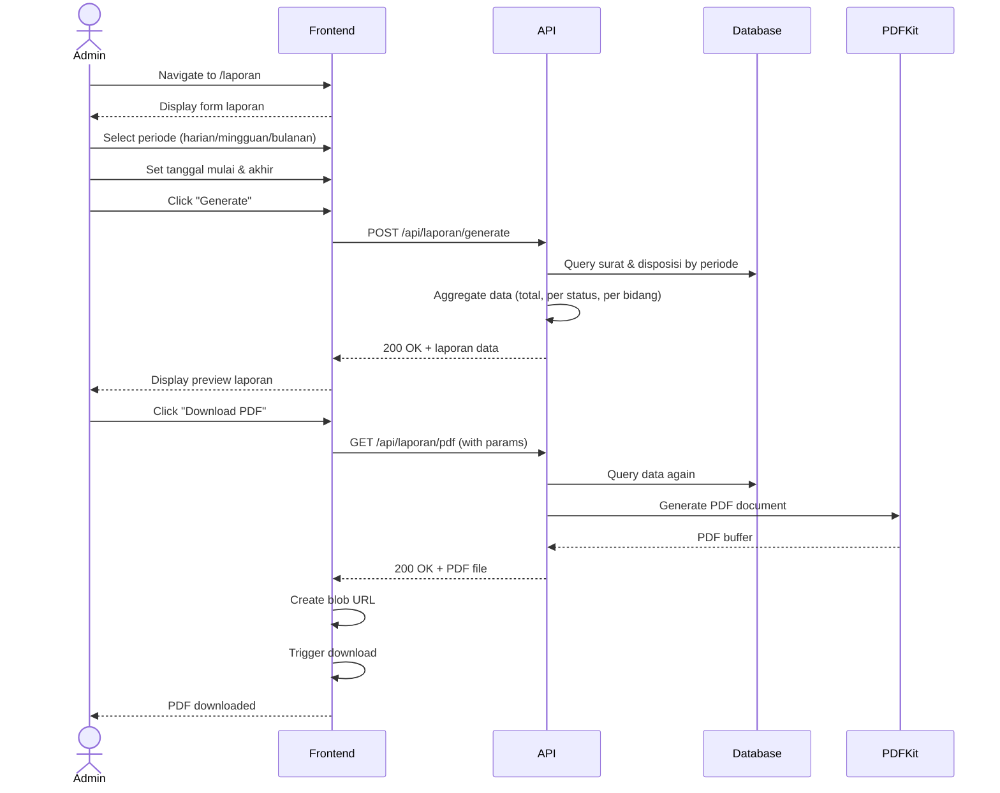

# System Logic: UC-008 Download Laporan PDF

Document Version: v1.0

Use Case ID: UC-008

Use Case Name: Download Laporan PDF

Status: Draft

Last Updated: 2026-06-28

Author: System Analyst AI

---

## 1. Overview

This document defines the system logic for generating and downloading report PDF.

---

## 2. Related Screens

| Screen | Route | Description |
|---|---|---|
| Laporan | `/laporan` | Form generate + download PDF |

---

## 3. Related Entities

| Entity | Table | Description |
|---|---|---|
| Surat Masuk | `surat_masuk` | Data surat untuk laporan |
| Disposisi | `disposisi` | Data disposisi untuk laporan |

---

## 4. Sequence Diagram



---

## 5. API Contract

### 5.1 POST /api/laporan/generate

Generate data laporan.

**Request Headers:**

| Header | Value |
|---|---|
| Authorization | Bearer <jwt_token> |
| Content-Type | application/json |

**Request Body:**

```json
{
  "periode": "string (required: 'harian'/'mingguan'/'bulanan')",
  "tanggal_mulai": "date (required)",
  "tanggal_akhir": "date (required)"
}
```

**Success Response (200 OK):**

```json
{
  "success": true,
  "data": {
    "periode": "bulanan",
    "tanggal_mulai": "2026-06-01",
    "tanggal_akhir": "2026-06-30",
    "total_surat": 50,
    "surat_per_status": {
      "Diterima": 10,
      "Didisposisi": 15,
      "Diproses": 12,
      "Selesai": 13
    },
    "surat_per_bidang": {
      "Kurikulum": 15,
      "Kesiswaan": 12,
      "SaranaPrasarana": 10,
      "Humas": 8,
      "Keuangan": 5
    },
    "rata_waktu_penyelesaian": "3.5 hari"
  },
  "message": "Laporan berhasil digenerate"
}
```

---

### 5.2 GET /api/laporan/pdf

Download laporan sebagai PDF.

**Request Headers:**

| Header | Value |
|---|---|
| Authorization | Bearer <jwt_token> |

**Query Params:**

| Param | Type | Description |
|---|---|---|
| periode | string | periode laporan |
| tanggal_mulai | date | tanggal mulai |
| tanggal_akhir | date | tanggal akhir |

**Success Response (200 OK):**

Content-Type: application/pdf

Binary PDF file

---

## 6. Traceability

| User Flow | Requirement | API Endpoint |
|---|---|---|
| userflow_uc_008.md | F-10, F-16, BR-09 | POST /api/laporan/generate, GET /api/laporan/pdf |
