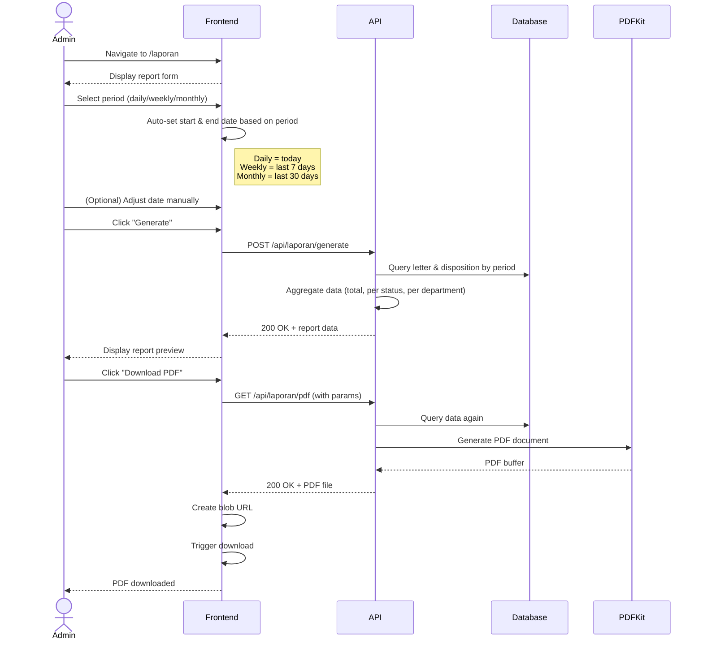

# System Logic: UC-008 Download PDF Report

Document Version: v1.0

Use Case ID: UC-008

Use Case Name: Download PDF Report

Status: Draft

Last Updated: 2026-07-16

Author: System Analyst AI

---

## 1. Overview

This document defines the system logic for generating and downloading PDF reports.

---

## 2. Related Pages

| Page | Route | Description |
|---|---|---|
| Report | `/laporan` | Generate form + PDF download |

---

## 3. Related Entities

| Entity | Table | Description |
|---|---|---|
| Incoming Letter | `surat_masuk` | Letter data for report |
| Disposition | `disposisi` | Disposition data for report |

---

## 4. Sequence Diagram



---

## 5. API Contract

### 5.1 POST /api/laporan/generate

Generate report data.

**Request Headers:**

| Header | Value |
|---|---|
| Authorization | Bearer <jwt_token> |
| Content-Type | application/json |

**Request Body:**

```json
{
  "periode": "string (required: 'daily'/'weekly'/'monthly')",
  "tanggal_mulai": "date (required)",
  "tanggal_akhir": "date (required)"
}
```

**Success Response (200 OK):**

```json
{
  "success": true,
  "data": {
    "periode": "monthly",
    "tanggal_mulai": "2026-06-01",
    "tanggal_akhir": "2026-06-30",
    "total_surat": 50,
    "surat_per_status": {
      "Diterima": 10,
      "Didisposisi": 15,
      "Diproses": 12,
      "Selesai": 13
    },
    "surat_per_bidang": {
      "Kurikulum": 15,
      "Kesiswaan": 12,
      "SaranaPrasarana": 10,
      "Humas": 8,
      "Keuangan": 5
    },
    "rata_waktu_penyelesaian": "3.5 hari"
  },
  "message": "Report generated successfully"
}
```

---

### 5.2 GET /api/laporan/pdf

Download report as PDF.

**Request Headers:**

| Header | Value |
|---|---|
| Authorization | Bearer <jwt_token> |

**Query Params:**

| Param | Type | Description |
|---|---|---|
| periode | string | Report period |
| tanggal_mulai | date | Start date |
| tanggal_akhir | date | End date |

**Success Response (200 OK):**

Content-Type: application/pdf

Binary PDF file

---

## 6. Data Flow

When the user selects a period (daily/weekly/monthly), the frontend automatically adjusts the date range: Daily = today, Weekly = last 7 days, Monthly = last 30 days. The user can adjust dates manually after selecting a period. Period and date parameters are sent from the frontend to the `POST /api/laporan/generate` endpoint. The backend runs SQL queries to fetch incoming letter and disposition data within the given date range. The queried data is aggregated: total letters, count per status (Received/Dispositioned/Processing/Completed), count per department, and average completion time. To generate PDF, the same aggregated data is sent to the PDFKit library which produces a PDF buffer returned to the client as a file download.

---

## 7. Validation Rules

| Rule | Description |
|---|---|
| `periode` must be one of: daily, weekly, monthly | If value is invalid, return 400 Bad Request |
| `tanggal_mulai` and `tanggal_akhir` must be valid dates | Format must be YYYY-MM-DD and be a valid date |
| `tanggal_mulai` must be before or equal to `tanggal_akhir` | If tanggal_mulai > tanggal_akhir, return 400 Bad Request |

---

## 8. Security Rules

| Rule | Description |
|---|---|
| JWT authentication required | Endpoint requires `Authorization: Bearer <jwt>` header |
| Only Admin TU can access reports (BR-09) | Endpoint checks user role from JWT; only `ADMIN_TU` and `KEPALA_SEKOLAH` roles are allowed |

---

## 9. Business Rule References

| Code | Rule |
|---|---|
| BR-09 | Reports can only be accessed by Admin TU and Principal |

---

## 11. Traceability

| User Flow | Requirement | API Endpoint |
|---|---|---|
| userflow_uc_008.md | F-10, F-16, BR-09 | POST /api/laporan/generate, GET /api/laporan/pdf |