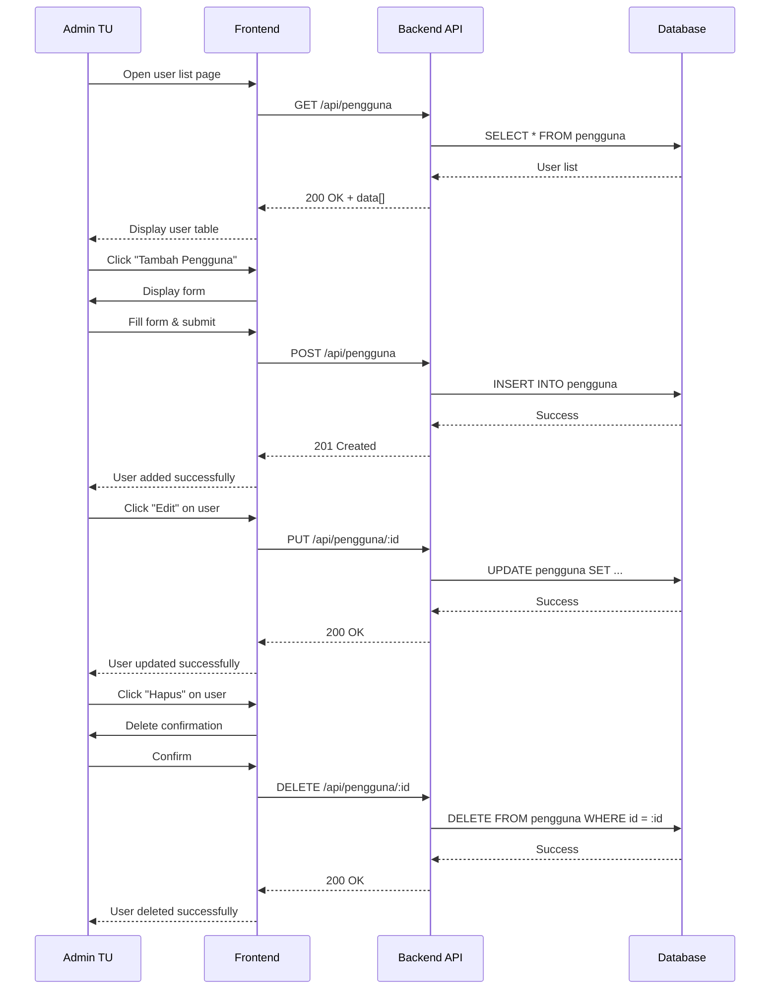

# System Logic: UC-009 Manage User Accounts

Document Version: v1.0

Use Case ID: UC-009

Use Case Name: Manage User Accounts

Status: Draft

Last Updated: 2026-06-28

Author: System Analyst AI

---

## 1. Overview

This document defines the system logic for managing user accounts (CRUD) by Admin TU.

---

## 2. Related Pages

| Page | Route | Description |
|---|---|---|
| User List | `/pengguna` | User account list table |
| Add User | `/pengguna/tambah` | New account form |
| Edit User | `/pengguna/:id/edit` | Account edit form |

---

## 3. Related Entities

| Entity | Table | Description |
|---|---|---|
| User | `pengguna` | User account data |

---

## 4. Sequence Diagram



---

## 5. API Contract

### 5.1 GET /api/pengguna

List all users.

**Success Response (200 OK):**

```json
{
  "success": true,
  "data": [
    {
      "id": "uuid",
      "username": "admin",
      "nama_lengkap": "Admin TU",
      "role": "ADMIN_TU",
      "bidang": null,
      "is_active": true,
      "created_at": "2026-06-28T00:00:00Z"
    }
  ],
  "message": "Success"
}
```

---

### 5.2 POST /api/pengguna

Add new user.

**Request Body:**

```json
{
  "username": "string (required, unique)",
  "password": "string (required, min 6)",
  "nama_lengkap": "string (required)",
  "role": "string (required: ADMIN_TU/KEPALA_SEKOLAH/GURU_STAF/WAKASEK)",
  "bidang": "string (required if role=GURU_STAF/WAKASEK)"
}
```

**Success Response (201 Created):**

```json
{
  "success": true,
  "data": {
    "id": "uuid",
    "username": "guru6",
    "nama_lengkap": "Guru Baru",
    "role": "GURU_STAF",
    "bidang": "Kurikulum",
    "is_active": true
  },
  "message": "User added successfully"
}
```

---

### 5.3 PUT /api/pengguna/:id

Update user data.

**Request Body:**

```json
{
  "nama_lengkap": "string (optional)",
  "role": "string (optional)",
  "bidang": "string (optional)",
  "is_active": "boolean (optional)"
}
```

**Success Response (200 OK):**

```json
{
  "success": true,
  "data": null,
  "message": "User updated successfully"
}
```

---

### 5.4 DELETE /api/pengguna/:id

Delete user.

**Success Response (200 OK):**

```json
{
  "success": true,
  "data": null,
  "message": "User deleted successfully"
}
```

---

## 6. Data Flow

1. Admin TU opens `/pengguna` page, frontend calls `GET /api/pengguna`.
2. Backend fetches all user data from `pengguna` table and returns list.
3. To add user, Admin TU fills form → frontend sends `POST /api/pengguna` → backend validates data → inserts into `pengguna` table → returns newly created data.
4. To edit, Admin TU changes data on form → frontend sends `PUT /api/pengguna/:id` → backend validates and updates `pengguna` table.
5. To delete, Admin TU confirms deletion → frontend sends `DELETE /api/pengguna/:id` → backend deletes record from `pengguna` table.
6. All CRUD operations can only be accessed by `ADMIN_TU` role.

---

## 7. Validation Rules

| Column | Rule |
|---|---|
| `username` | Required, min 3 characters, unique |
| `password` | Required, min 6 characters |
| `nama_lengkap` | Required |
| `role` | Must be one of: `ADMIN_TU`, `KEPALA_SEKOLAH`, `GURU_STAF`, `WAKASEK` |
| `bidang` | Required if role is `GURU_STAF` or `WAKASEK` |

---

## 8. Security Rules

- JWT authentication required for all endpoints
- Only Admin TU can manage users (BR-02)

---

## 9. Business Rule References

| Code | Rule |
|---|---|
| BR-02 | Accounts can only be created by Admin TU |
| BR-10 | Vice Principal can only see letters related to their department |
| BR-11 | Teacher/Staff can only see letters disposed to them |

---

## 11. Traceability

| User Flow | Requirement | API Endpoint |
|---|---|---|
| userflow_uc_009.md | F-02, BR-02 | GET/POST/PUT/DELETE /api/pengguna |