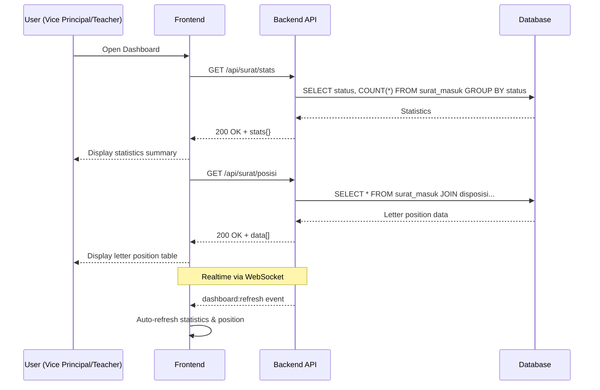

# System Logic: UC-010 View Monitoring Dashboard

Document Version: v1.0

Use Case ID: UC-010

Use Case Name: View Monitoring Dashboard

Status: Draft

Last Updated: 2026-06-28

Author: System Analyst AI

---

## 1. Overview

This document defines the system logic for viewing the dashboard with statistics and live letter position table.

---

## 2. Related Pages

| Page | Route | Description |
|---|---|---|
| Dashboard | `/dashboard` | Statistics summary + Letter Position |

---

## 3. Related Entities

| Entity | Table | Description |
|---|---|---|
| Incoming Letter | `surat_masuk` | Letter data for statistics |
| Disposition | `disposisi` | Disposition data |

---

## 4. Sequence Diagram



---

## 5. API Contract

### 5.1 GET /api/surat/stats

Dashboard statistics.

**Success Response (200 OK):**

```json
{
  "success": true,
  "data": {
    "total_surat": 50,
    "diterima": 10,
    "didisposisi": 15,
    "diproses": 12,
    "selesai": 13,
    "overdue": 5
  },
  "message": "Success"
}
```

---

### 5.2 GET /api/surat/posisi

Letter position (live table).

**Success Response (200 OK):**

```json
{
  "success": true,
  "data": [
    {
      "id": "uuid",
      "nomor_surat": "001/SM9-YK/VI/2026",
      "pengirim": "Dinas Pendidikan Kota Yogyakarta",
      "perihal": "Undangan Rapat Koordinasi",
      "status": "Didisposisi",
      "posisi_saat_ini": "Kurikulum"
    }
  ],
  "message": "Success"
}
```

---

## 6. Data Flow

1. User opens dashboard page → frontend sends `GET /api/surat/stats` to fetch statistics based on letter status (Received, Dispositioned, Processing, Completed, Overdue).
2. Frontend sends `GET /api/surat/posisi` to fetch current letter position data, including sender info, subject, status, and current position.
3. Letter position data is filtered based on user access rights:
   - Vice Principal only sees letters related to their department (BR-10).
   - Teacher/Staff only sees letters disposed to them (BR-11).
4. Data changes are triggered in real-time via WebSocket event `dashboard:refresh` to room roles `KEPALA_SEKOLAH` and `WAKASEK` (BR-15).

---

## 7. Validation Rules

Dashboard is read-only. No data validation is needed for the dashboard. Validation only applies to query parameters `GET /api/surat/stats` and `GET /api/surat/posisi`.

---

## 8. Security Rules

- JWT authentication required for all endpoints
- Vice Principal only sees their department letters (BR-10)
- Teacher/Staff only sees dispositions directed to them (BR-11)

---

## 9. Business Rule References

| Code | Rule |
|---|---|
| BR-10 | Vice Principal only sees their department letters |
| BR-11 | Teacher/Staff only sees letter dispositions |
| BR-15 | Data changes pushed in realtime via WebSocket |

---

## 11. Traceability

| Event | Room | Description |
|---|---|---|
| dashboard:refresh | role:KEPALA_SEKOLAH | Dashboard needs refresh |
| dashboard:refresh | role:WAKASEK | Dashboard needs refresh |

| User Flow | Requirement | API Endpoint |
|---|---|---|
| userflow_uc_010.md | F-09, F-11, F-16 | GET /api/surat/stats, GET /api/surat/posisi |