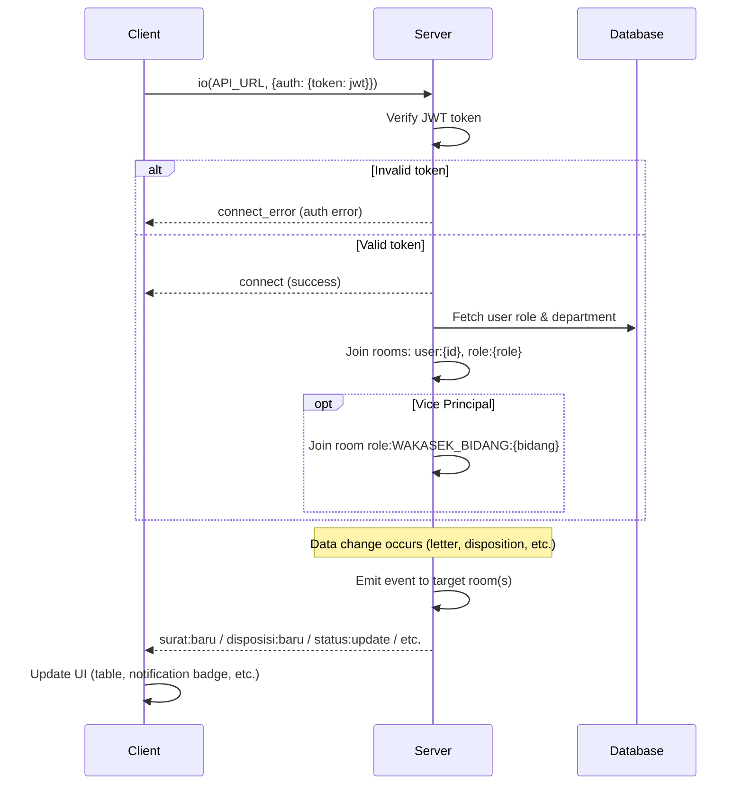

# System Logic: UC-011 Multi-Actor Realtime Sync

Document Version: v1.0

Use Case ID: UC-011

Use Case Name: Multi-Actor Realtime Sync

Status: Draft

Last Updated: 2026-06-28

Author: System Analyst AI

---

## 1. Overview

This document defines the system logic for realtime synchronization via WebSocket across multiple actors.

---

## 2. Related Pages

| Page | Route | Description |
|---|---|---|
| All Pages | - | Realtime updates on any page |

---

## 3. Related Entities

| Entity | Table | Description |
|---|---|---|
| All | All | Every data change triggers a WebSocket event |

---

## 4. Sequence Diagram



---

## 5. WebSocket Connection

### 5.1 Connection Setup

```javascript
// Client connects with JWT token
const socket = io(API_URL, {
  auth: { token: jwt_token }
});

// Server verifies token and joins rooms
socket.on('connect', () => {
  // Client joins rooms based on role
});
```

### 5.2 Room Structure

| Room | Description | Joined By |
|---|---|---|
| user:{id} | Personal notifications | All logged-in users |
| role:{role} | Role-based broadcast | All logged-in users |
| role:WAKASEK_BIDANG:{bidang} | Vice Principal per department | Vice Principal only |
| lacak:{nomorSurat} | Public (no login) | Users on /lacak |

---

## 10. WebSocket Events

### 6.1 Outgoing Events (Server → Client)

| Event | Target Room | Payload |
|---|---|---|
| surat:baru | role:KEPALA_SEKOLAH | SuratMasuk object |
| disposisi:baru | user:{idPenerima} | Disposisi object |
| status:update | role:KEPALA_SEKOLAH, role:WAKASEK_BIDANG:{bidang} | Latest status |
| notifikasi:baru | user:{idPenerima} | Notifikasi object |
| dashboard:refresh | role:KEPALA_SEKOLAH, role:WAKASEK | Refresh trigger |
| lacak:update | lacak:{nomorSurat} | {status, posisiSaatIni} |

### 6.2 Client Actions on Event

| Event | Client Action |
|---|---|
| surat:baru | Add letter to table, highlight row |
| disposisi:baru | Add disposition to list, show notification |
| status:update | Update status badge, highlight row |
| notifikasi:baru | Increment badge count, add to dropdown |
| dashboard:refresh | Refetch statistics and position table |
| lacak:update | Update tracking result |

---

## 6. Data Flow

1. **Event Source:** Server detects data changes (e.g., new letter, disposition, status update).
2. **Server resolution determines target room based on event type (role room, user room, department room, or public tracking room).**
3. **Event Dispatch:** Server sends typed event (e.g., `surat:baru`) to the matching room.
4. **Client Receipt:** All clients subscribed to that room receive the event with payload.
5. **UI Update:** Client processes the event and updates relevant UI components (table row, notification badge, tracking stepper, etc.).
6. **Fallback:** On disconnect, client auto-reconnects and refetches data from REST API to sync state.

---

## 8. Reconnection Logic

```javascript
socket.on('disconnect', () => {
  // Show "Reconnecting..." indicator
});

socket.on('connect', () => {
  // Resync data from REST API
  // Show "Reconnected" toast
});
```

---

## 7. Validation Rules

| Rule | Description |
|---|---|
| JWT Required | JWT token must be provided on WebSocket connection |
| Join Room: `user:{id}` | User can only join their own user room |
| Join Room: `role:{role}` | User can only join the room matching their own role |
| Join Room: `role:WAKASEK_BIDANG:{bidang}` | Vice Principal can only join the room matching their own department |

---

## 8. Security Rules

| Rule | Description |
|---|---|
| JWT Authentication | JWT authentication required on WebSocket connection; token verified before accepting connection |
| Room-Based Access Control | Server enforces room-based access control; client cannot join rooms they are not authorized for |

---

## 9. Business Rule References

| Code | Rule |
|---|---|
| BR-15 | Every data change must be pushed in realtime via WebSocket |
| NF-08 | Updates must be received by client within ≤ 2 seconds |
| NF-09 | Auto-reconnect with resync when connection is restored |

---

## 11. Traceability

| User Flow | Requirement | API Endpoint |
|---|---|---|
| userflow_uc_011.md | F-11, BR-15, NF-08, NF-09 | WebSocket (socket.io) |