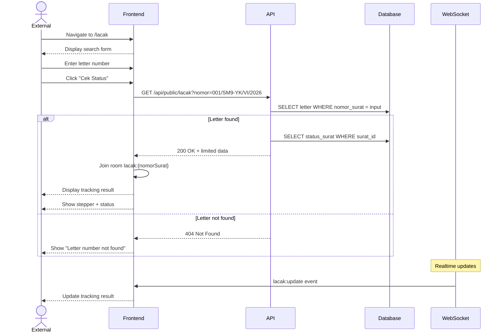

# System Logic: UC-012 Track Public Letter

Document Version: v1.0

Use Case ID: UC-012

Use Case Name: Track Public Letter (No Login)

Status: Draft

Last Updated: 2026-06-28

Author: System Analyst AI

---

## 1. Overview

This document defines the system logic for public letter tracking without login.

---

## 2. Related Pages

| Page | Route | Description |
|---|---|---|
| Track Letter | `/lacak` | Public letter tracking page |

---

## 3. Related Entities

| Entity | Table | Description |
|---|---|---|
| Incoming Letter | `surat_masuk` | Letter data (limited fields) |
| Letter Status | `status_surat` | Timeline for stepper |

---

## 4. Sequence Diagram



---

## 5. API Contract

### 5.1 GET /api/public/lacak

Track public letter status (no login).

**Request Headers:**

| Header | Value |
|---|---|
| (none) | Public endpoint, no JWT needed |

**Query Params:**

| Param | Type | Description |
|---|---|---|
| nomor | string | Letter number to search |

**Success Response (200 OK):**

```json
{
  "success": true,
  "data": {
    "nomor_surat": "001/SM9-YK/VI/2026",
    "pengirim": "Dinas Pendidikan Kota Yogyakarta",
    "perihal": "Undangan Rapat Koordinasi",
    "status": "Didisposisi",
    "posisi_saat_ini": "Kurikulum",
    "alur": [
      {
        "status": "Diterima",
        "tanggal": "2026-06-28T10:00:00Z",
        "oleh": "Kepala Sekolah"
      },
      {
        "status": "Didisposisi",
        "tanggal": "2026-06-28T10:30:00Z",
        "oleh": "Kurikulum"
      }
    ]
  },
  "message": "Letter found"
}
```

**Error Response (404 Not Found):**

```json
{
  "success": false,
  "data": null,
  "message": "Letter number not found",
  "errors": []
}
```

---

## 6. Data Flow

Data DISPLAYED:
- nomor_surat, pengirim, perihal
- status, posisi_saat_ini
- alur (stepper) with role names (not personal names)

Data NOT displayed:
- scan file
- disposition instructions
- full name of disposition recipient
- follow-up notes

---

## 10. WebSocket Events

| Event | Room | Payload |
|---|---|---|
| lacak:update | lacak:{nomorSurat} | {status, posisiSaatIni} |

---

## 7. Validation Rules

| Rule | Description |
|---|---|
| Query Param `nomor` | Required, string. Letter number to search. |
| Rate Limiting | Rate limiting per IP enforced (BR-17) |

---

## 8. Security Rules

| Rule | Description |
|---|---|
| No JWT Needed | Public endpoint, no authentication required |
| Rate-Limited Per IP | Endpoint rate-limited per IP address (BR-17) |
| Limited Data Only | Only returns limited data (BR-16): status, position, flow, role names — no personal names |

---

## 9. Business Rule References

| Code | Rule |
|---|---|
| BR-16 | Public tracking only displays status, position, flow, role names |
| BR-17 | Public endpoint does not require JWT, but must be rate-limited |

---

## 11. Traceability

| User Flow | Requirement | API Endpoint |
|---|---|---|
| userflow_uc_012.md | F-12, BR-16, BR-17 | GET /api/public/lacak |