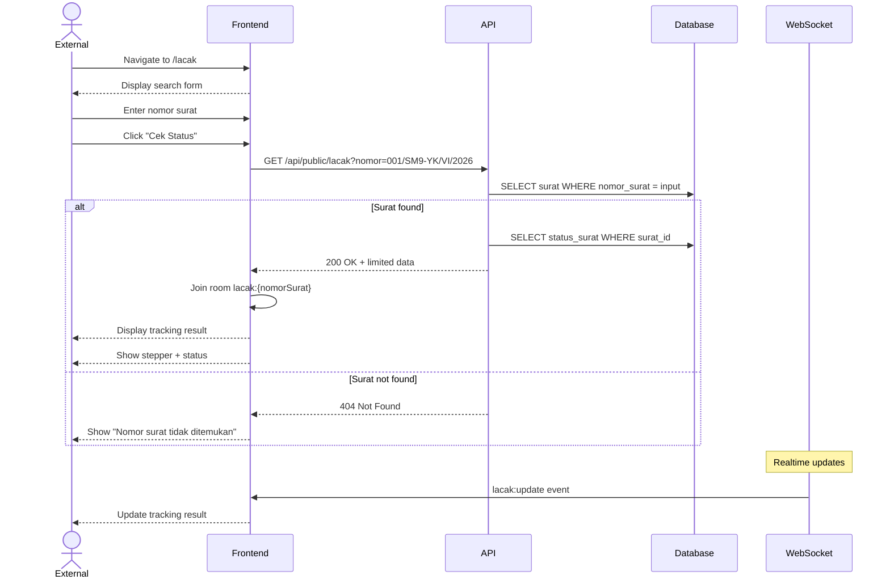

# System Logic: UC-012 Lacak Surat Publik

Document Version: v1.0

Use Case ID: UC-012

Use Case Name: Lacak Surat Publik (Tanpa Login)

Status: Draft

Last Updated: 2026-06-28

Author: System Analyst AI

---

## 1. Overview

This document defines the system logic for public letter tracking without login.

---

## 2. Related Screens

| Screen | Route | Description |
|---|---|---|
| Lacak Surat | `/lacak` | Halaman publik pelacakan surat |

---

## 3. Related Entities

| Entity | Table | Description |
|---|---|---|
| Surat Masuk | `surat_masuk` | Data surat (limited fields) |
| Status Surat | `status_surat` | Timeline untuk stepper |

---

## 4. Sequence Diagram



---

## 5. API Contract

### 5.1 GET /api/public/lacak

Lacak status surat publik (tanpa login).

**Request Headers:**

| Header | Value |
|---|---|
| (none) | Endpoint publik, tidak perlu JWT |

**Query Params:**

| Param | Type | Description |
|---|---|---|
| nomor | string | Nomor surat yang dicari |

**Success Response (200 OK):**

```json
{
  "success": true,
  "data": {
    "nomor_surat": "001/SM9-YK/VI/2026",
    "pengirim": "Dinas Pendidikan Kota Yogyakarta",
    "perihal": "Undangan Rapat Koordinasi",
    "status": "Didisposisi",
    "posisi_saat_ini": "Kurikulum",
    "alur": [
      {
        "status": "Diterima",
        "tanggal": "2026-06-28T10:00:00Z",
        "oleh": "Kepala Sekolah"
      },
      {
        "status": "Didisposisi",
        "tanggal": "2026-06-28T10:30:00Z",
        "oleh": "Kurikulum"
      }
    ]
  },
  "message": "Surat ditemukan"
}
```

**Error Response (404 Not Found):**

```json
{
  "success": false,
  "data": null,
  "message": "Nomor surat tidak ditemukan",
  "errors": []
}
```

---

## 6. Data Filtering (BR-16)

Data yang DITAMPILKAN:
- nomor_surat, pengirim, perihal
- status, posisi_saat_ini
- alur (stepper) dengan nama role (bukan nama orang)

Data yang TIDAK ditampilkan:
- file scan
- instruksi disposisi
- nama lengkap penerima disposisi
- catatan tindak lanjut

---

## 7. WebSocket Events

| Event | Room | Payload |
|---|---|---|
| lacak:update | lacak:{nomorSurat} | {status, posisiSaatIni} |

---

## 8. Business Rules Reference

| Code | Rule |
|---|---|
| BR-16 | Pelacakan publik hanya menampilkan status, posisi, alur, nama role |
| BR-17 | Endpoint publik tidak memerlukan JWT, tetapi harus di-rate-limit |

---

## 9. Traceability

| User Flow | Requirement | API Endpoint |
|---|---|---|
| userflow_uc_012.md | F-12, BR-16, BR-17 | GET /api/public/lacak |
