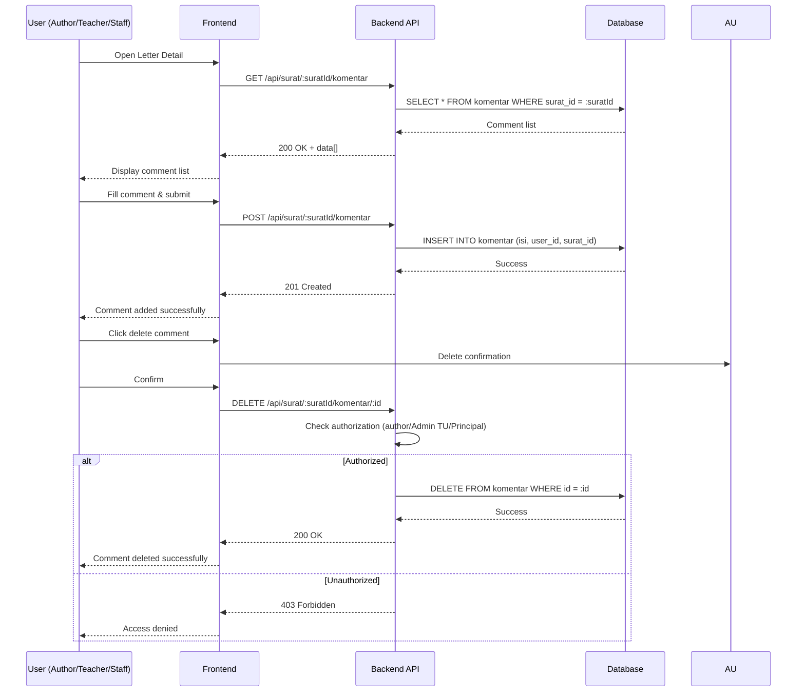

# System Logic: UC-013 Add Comment

Document Version: v1.0

Use Case ID: UC-013

Use Case Name: Add Comment to Letter

Status: Draft

Last Updated: 2026-06-28

Author: System Analyst AI

---

## 1. Overview

This document defines the system logic for adding comments to letters.

---

## 2. Related Pages

| Page | Route | Description |
|---|---|---|
| Letter Detail | `/surat/:id` | Letter detail + comments section |
| Disposition Detail | `/disposisi/:id` | Disposition detail + comments section |

---

## 3. Related Entities

| Entity | Table | Description |
|---|---|---|
| Comment | `komentar` | Team discussion comment data |
| User | `pengguna` | Comment author |

---

## 4. Sequence Diagram



---

## 5. API Contract

### 5.1 GET /api/surat/:suratId/komentar

Get letter comments.

**Success Response (200 OK):**

```json
{
  "success": true,
  "data": [
    {
      "id": "uuid",
      "isi": "Sudah saya terima",
      "user": {
        "id": "uuid",
        "nama_lengkap": "Guru Kurikulum",
        "role": "GURU_STAF"
      },
      "created_at": "2026-06-28T11:00:00Z"
    }
  ],
  "message": "Success"
}
```

---

### 5.2 POST /api/surat/:suratId/komentar

Add new comment.

**Request Body:**

```json
{
  "isi": "string (required, min 1 char)"
}
```

**Success Response (201 Created):**

```json
{
  "success": true,
  "data": {
    "id": "uuid",
    "isi": "Sudah saya terima",
    "user_id": "uuid",
    "created_at": "2026-06-28T11:00:00Z"
  },
  "message": "Comment added successfully"
}
```

---

### 5.3 DELETE /api/surat/:suratId/komentar/:id

Delete comment.

**Success Response (200 OK):**

```json
{
  "success": true,
  "data": null,
  "message": "Comment deleted successfully"
}
```

**Error Response (403 Forbidden):**

```json
{
  "success": false,
  "data": null,
  "message": "You do not have access to delete this comment",
  "errors": []
}
```

---

## 6. Data Flow

1. User opens Letter Detail → frontend sends `GET /api/surat/:suratId/komentar` to fetch all comments related to the letter.
2. Backend fetches comment data from `komentar` table along with author data from `pengguna` table, then returns comment list.
3. To add comment, user fills form → frontend sends `POST /api/surat/:suratId/komentar` → backend validates data → inserts into `komentar` table with `user_id` from JWT token → returns new comment.
4. To delete comment, user confirms deletion → frontend sends `DELETE /api/surat/:suratId/komentar/:id` → backend checks authorization (author, Admin TU, or Principal) → if authorized, comment is deleted from `komentar` table.
5. Comment data is linked to `Surat` and `Pengguna` (author) entities.

---

## 7. Validation Rules

| Column | Rule |
|---|---|
| `isi` | Required, min 1 character |
| `suratId` | Must be valid UUID |
| `:id` (komentar) | Must be valid UUID |

---

## 8. Security Rules

- JWT authentication required for all endpoints
- Delete only by author, Admin TU, or Principal (BR-18)

---

## 9. Business Rule References

| Code | Rule |
|---|---|
| BR-18 | Comments can only be deleted by author, Admin TU, or Principal |

---

## 11. Traceability

| User Flow | Requirement | API Endpoint |
|---|---|---|
| userflow_uc_013.md | F-13, BR-18 | GET/POST/DELETE /api/surat/:suratId/komentar |