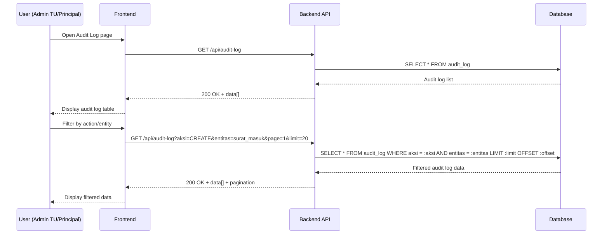

# System Logic: UC-014 View Audit Log

Document Version: v1.0

Use Case ID: UC-014

Use Case Name: View Audit Log

Status: Draft

Last Updated: 2026-06-28

Author: System Analyst AI

---

## 1. Overview

This document defines the system logic for viewing the audit log.

---

## 2. Related Pages

| Page | Route | Description |
|---|---|---|
| Audit Log | `/audit-log` | Change log list |

---

## 3. Related Entities

| Entity | Table | Description |
|---|---|---|
| Audit Log | `audit_log` | Automatic change recording |
| User | `pengguna` | User who performed the action |

---

## 4. Sequence Diagram



---

## 5. API Contract

### 5.1 GET /api/audit-log

Audit log list.

**Query Params:**

| Param | Type | Description |
|---|---|---|
| aksi | string | Filter action (CREATE/UPDATE_STATUS/DELETE) |
| entitas | string | Filter entity (surat_masuk/disposisi/pengguna) |
| page | number | Page |
| limit | number | Limit per page |

**Success Response (200 OK):**

```json
{
  "success": true,
  "data": {
    "audit_log": [
      {
        "id": "uuid",
        "user": {
          "nama_lengkap": "Admin TU",
          "role": "ADMIN_TU"
        },
        "aksi": "CREATE",
        "entitas": "surat_masuk",
        "entitas_id": "uuid",
        "detail": "New incoming letter: 001/SM9-YK/VI/2026",
        "ip_address": "192.168.1.1",
        "created_at": "2026-06-28T10:00:00Z"
      }
    ],
    "pagination": {
      "total": 100,
      "page": 1,
      "limit": 20,
      "totalPages": 5
    }
  },
  "message": "Success"
}
```

---

## 6. Data Flow

1. User opens Audit Log page → frontend sends `GET /api/audit-log` to fetch audit log data.
2. Backend fetches data from `audit_log` table which records every change to `surat_masuk`, `disposisi`, and `pengguna` entities.
3. Each audit log row contains user info who performed the action (from `pengguna` table), action type (CREATE, UPDATE_STATUS, DELETE), affected entity, change details, and IP address.
4. User can filter data by `aksi` and `entitas` via query parameters.
5. Data is returned with pagination information (total, page, limit, totalPages).
6. Only Admin TU and Principal can access audit log (BR-19).

---

## 7. Validation Rules

| Column | Rule |
|---|---|
| `aksi` | Optional, must be one of: `CREATE`, `UPDATE_STATUS`, `DELETE` |
| `entitas` | Optional, must be one of: `surat_masuk`, `disposisi`, `pengguna` |
| `page` | Must be positive integer |
| `limit` | Must be positive integer |

---

## 8. Security Rules

- JWT authentication required for all endpoints
- Only Admin TU and Principal can view audit log (BR-19)

---

## 9. Business Rule References

| Code | Rule |
|---|---|
| BR-19 | Audit Log can only be viewed by Admin TU and Principal |

---

## 11. Traceability

| User Flow | Requirement | API Endpoint |
|---|---|---|
| userflow_uc_014.md | F-15, BR-19 | GET /api/audit-log |