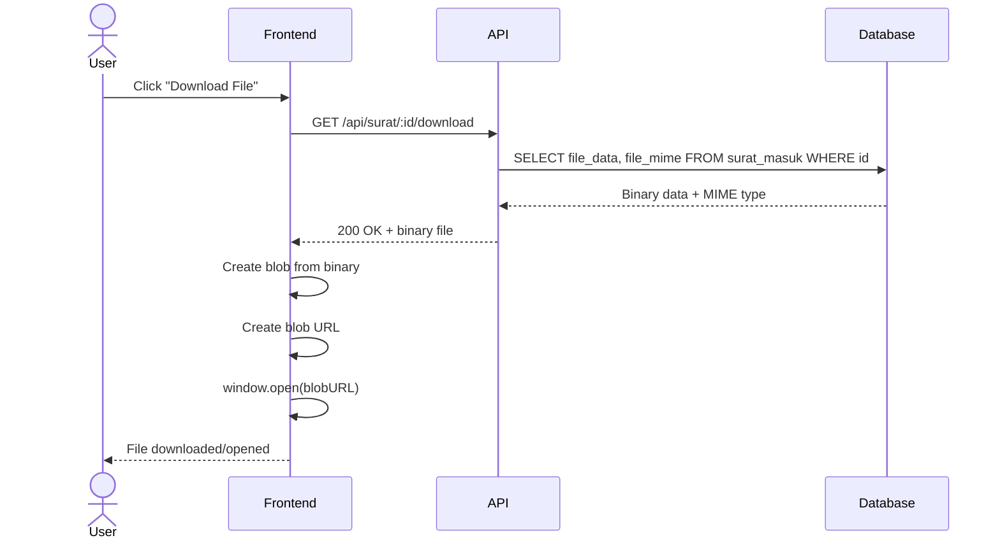

# System Logic: UC-015 Download File Scan

Document Version: v1.0

Use Case ID: UC-015

Use Case Name: Download File Scan Surat

Status: Draft

Last Updated: 2026-06-28

Author: System Analyst AI

---

## 1. Overview

This document defines the system logic for downloading scanned letter files from database.

---

## 2. Related Screens

| Screen | Route | Description |
|---|---|---|
| Detail Surat | `/surat/:id` | Tombol download file scan |
| Detail Disposisi | `/disposisi/:id` | Tombol download file scan |

---

## 3. Related Entities

| Entity | Table | Description |
|---|---|---|
| Surat Masuk | `surat_masuk` | File scan (BYTEA) |

---

## 4. Sequence Diagram



---

## 5. API Contract

### 5.1 GET /api/surat/:id/download

Download file scan dari database.

**Request Headers:**

| Header | Value |
|---|---|
| Authorization | Bearer <jwt_token> |

**Success Response (200 OK):**

Content-Type: {file_mime} (e.g., application/pdf, image/jpeg)

Binary file data

**Error Response (404 Not Found):**

```json
{
  "success": false,
  "data": null,
  "message": "File tidak ditemukan",
  "errors": []
}
```

---

## 6. Business Rules Reference

| Code | Rule |
|---|---|
| BR-20 | File scan disimpan sebagai BYTEA di database, diunduh melalui endpoint dengan JWT |

---

## 7. Traceability

| User Flow | Requirement | API Endpoint |
|---|---|---|
| userflow_uc_015.md | F-03, BR-20 | GET /api/surat/:id/download |
