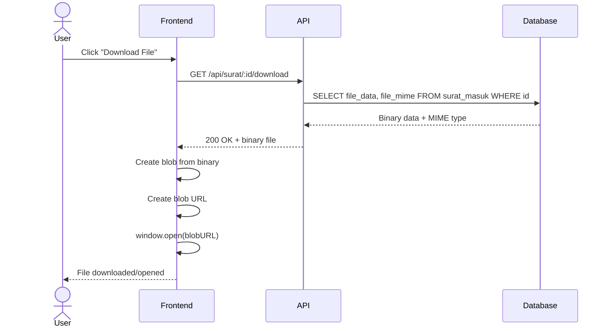

# System Logic: UC-015 Download Scan File

Document Version: v1.0

Use Case ID: UC-015

Use Case Name: Download Letter Scan File

Status: Draft

Last Updated: 2026-06-28

Author: System Analyst AI

---

## 1. Overview

This document defines the system logic for downloading letter scan files from the database.

---

## 2. Related Pages

| Page | Route | Description |
|---|---|---|
| Letter Detail | `/surat/:id` | Scan file download button |
| Disposition Detail | `/disposisi/:id` | Scan file download button |

---

## 3. Related Entities

| Entity | Table | Description |
|---|---|---|
| Incoming Letter | `surat_masuk` | Scan file (BYTEA) |

---

## 4. Sequence Diagram



---

## 5. API Contract

### 5.1 GET /api/surat/:id/download

Download scan file from database.

**Request Headers:**

| Header | Value |
|---|---|
| Authorization | Bearer <jwt_token> |

**Success Response (200 OK):**

Content-Type: {file_mime} (e.g., application/pdf, image/jpeg)

Binary file data

**Error Response (404 Not Found):**

```json
{
  "success": false,
  "data": null,
  "message": "File not found",
  "errors": []
}
```

---

## 6. Data Flow

1. **Request Received:** API receives `GET /api/surat/:id/download` with JWT token.
2. **Authentication & Lookup:** Server authenticates user, verifies letter access rights, queries `surat_masuk` for `file_data` (BYTEA) and `file_mime`.
3. **Binary Stream:** Server reads raw BYTEA binary data from database row.
4. **Response Headers:** Server sets `Content-Type` to stored MIME type and `Content-Disposition` for download.
5. **Stream to Client:** Binary data is streamed to client as HTTP response body.
6. **Client Handling:** Frontend creates Blob from binary, generates blob URL, and triggers download or opens in new tab.

---

## 7. Validation Rules

| Rule | Description |
|---|---|
| UUID Format | `:id` must be valid UUID |

---

## 8. Security Rules

| Rule | Description |
|---|---|
| JWT Authentication | JWT authentication required (Bearer token in Authorization header) |
| Role-Based Access | Access follows same letter access rules (e.g., Principal sees all, Vice Principal sees department letters, Admin sees all) |

---

## 9. Business Rule References

| Code | Rule |
|---|---|
| BR-20 | Scan files stored as BYTEA in database, downloaded via endpoint with JWT |

---

## 11. Traceability

| User Flow | Requirement | API Endpoint |
|---|---|---|
| userflow_uc_015.md | F-03, BR-20 | GET /api/surat/:id/download |