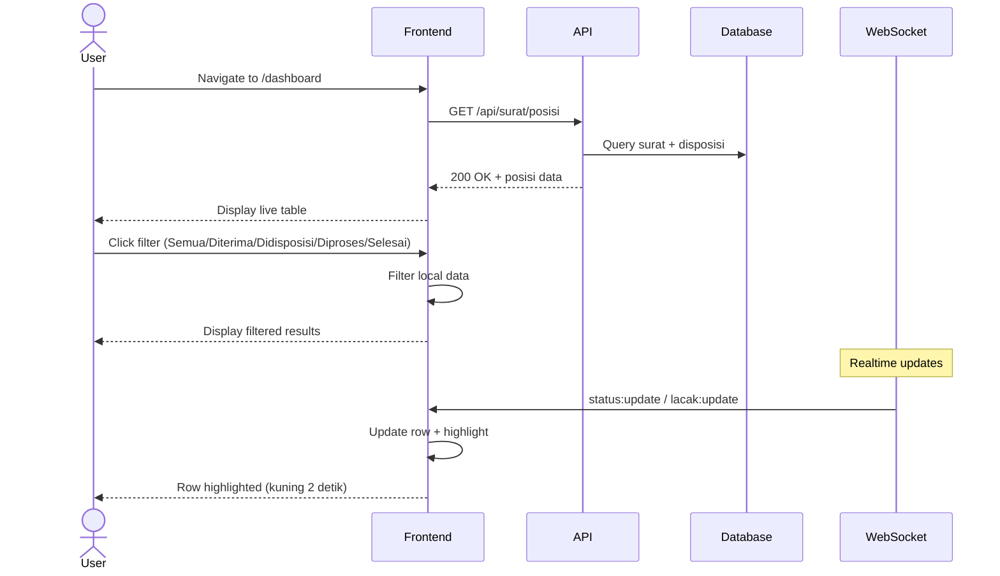

# System Logic: UC-016 Lihat Posisi Surat (Live Table)

Document Version: v1.0

Use Case ID: UC-016

Use Case Name: Lihat Posisi Surat (Live Table)

Status: Draft

Last Updated: 2026-06-28

Author: System Analyst AI

---

## 1. Overview

This document defines the system logic for viewing live position table of letters.

---

## 2. Related Screens

| Screen | Route | Description |
|---|---|---|
| Dashboard | `/dashboard` | Posisi Surat live table |

---

## 3. Related Entities

| Entity | Table | Description |
|---|---|---|
| Surat Masuk | `surat_masuk` | Data posisi surat |
| Disposisi | `disposisi` | Data penerima disposisi |

---

## 4. Sequence Diagram



---

## 5. API Contract

### 5.1 GET /api/surat/posisi

Posisi surat (live table).

**Request Headers:**

| Header | Value |
|---|---|
| Authorization | Bearer <jwt_token> |

**Success Response (200 OK):**

```json
{
  "success": true,
  "data": [
    {
      "id": "uuid",
      "nomor_surat": "001/SM9-YK/VI/2026",
      "pengirim": "Dinas Pendidikan Kota Yogyakarta",
      "perihal": "Undangan Rapat Koordinasi",
      "status": "Didisposisi",
      "posisi_saat_ini": "Kurikulum"
    }
  ],
  "message": "Success"
}
```

---

## 6. WebSocket Events

| Event | Room | Description |
|---|---|---|
| status:update | role:KEPALA_SEKOLAH, role:WAKASEK | Update posisi surat |
| lacak:update | lacak:{nomorSurat} | Update untuk publik |

**Client Action on Event:**
1. Find row by nomor_surat
2. Update status & posisi columns
3. Apply highlight animation (#FEF9C3 for 2 seconds)

---

## 7. Traceability

| User Flow | Requirement | API Endpoint |
|---|---|---|
| userflow_uc_016.md | F-11, F-16, BR-15 | GET /api/surat/posisi |
