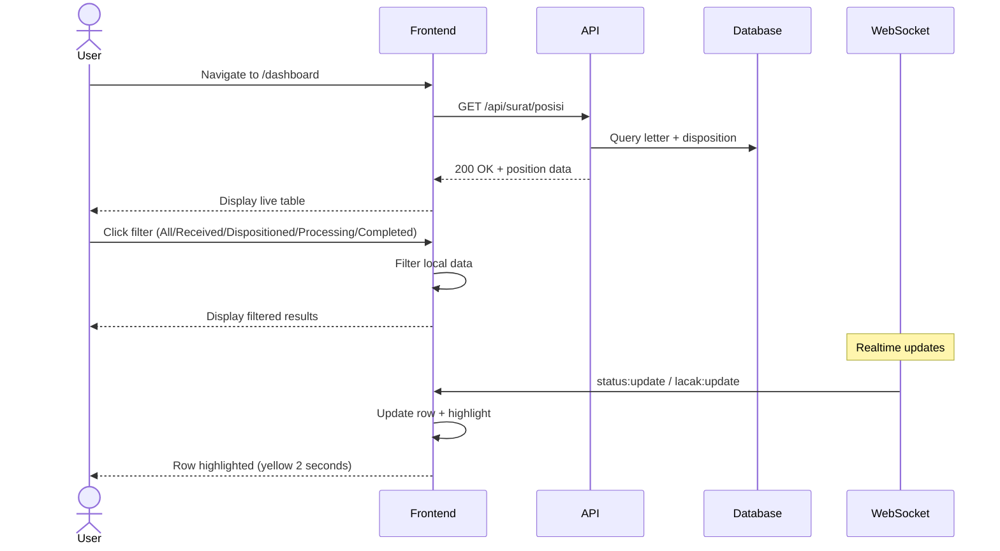

# System Logic: UC-016 View Letter Position (Live Table)

Document Version: v1.0

Use Case ID: UC-016

Use Case Name: View Letter Position (Live Table)

Status: Draft

Last Updated: 2026-06-28

Author: System Analyst AI

---

## 1. Overview

This document defines the system logic for viewing the live letter position table.

---

## 2. Related Pages

| Page | Route | Description |
|---|---|---|
| Dashboard | `/dashboard` | Letter Position live table |

---

## 3. Related Entities

| Entity | Table | Description |
|---|---|---|
| Incoming Letter | `surat_masuk` | Letter position data |
| Disposition | `disposisi` | Disposition recipient data |

---

## 4. Sequence Diagram



---

## 5. API Contract

### 5.1 GET /api/surat/posisi

Letter position (live table).

**Request Headers:**

| Header | Value |
|---|---|
| Authorization | Bearer <jwt_token> |

**Success Response (200 OK):**

```json
{
  "success": true,
  "data": [
    {
      "id": "uuid",
      "nomor_surat": "001/SM9-YK/VI/2026",
      "pengirim": "Dinas Pendidikan Kota Yogyakarta",
      "perihal": "Undangan Rapat Koordinasi",
      "status": "Didisposisi",
      "posisi_saat_ini": "Kurikulum"
    }
  ],
  "message": "Success"
}
```

---

## 6. Data Flow

1. **Data Source:** `surat_masuk` table provides core letter data (number, sender, subject).
2. **Position Resolution:** `disposisi` table provides latest disposition per letter; `status_surat` provides status timeline.
3. **Aggregation:** API joins surat_masuk + disposisi + status_surat to calculate `status` (from status_surat) and `posisi_saat_ini` (target role of latest disposition).
4. **Response:** Aggregated position data is returned as JSON array.
5. **Realtime Update:** WebSocket events (`status:update`, `lacak:update`) push changes; client finds row by `nomor_surat`, updates columns, and applies highlight animation.

---

## 10. WebSocket Events

| Event | Room | Description |
|---|---|---|
| status:update | role:KEPALA_SEKOLAH, role:WAKASEK | Letter position update |
| lacak:update | lacak:{nomorSurat} | Public update |

**Client Actions on Event:**
1. Find row by nomor_surat
2. Update status & position columns
3. Apply highlight animation (#FEF9C3 for 2 seconds)

---

## 7. Validation Rules

| Rule | Description |
|---|---|
| Endpoint Read-Only | GET only; no write operations, minimal validation needed |

---

## 8. Security Rules

| Rule | Description |
|---|---|
| JWT Authentication | JWT authentication required (Bearer token in Authorization header) |
| Admin TU & Principal | See all letters (no filter) |
| Vice Principal | Only see their department letters (BR-10) |

---

## 9. Business Rule References

| Code | Rule |
|---|---|
| BR-10 | Vice Principal only sees their department letters |
| BR-15 | Data changes pushed in realtime via WebSocket |

---

## 11. Traceability

| User Flow | Requirement | API Endpoint |
|---|---|---|
| userflow_uc_016.md | F-11, F-16, BR-15 | GET /api/surat/posisi |